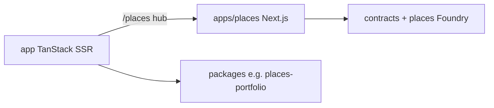

# Building Culture — monorepo (`b3`)

One app, one story: community, drops, onchain identity, and real-estate tokenization — with clear separation between **Play drops**, **NFT marketplace**, and **Places (REOC) securities**.

## What this repo is

**Building Culture** is a community-owned growth platform on **Base**: Culture Layer identity (`.culture` names), quests and points, experience drops, NFT marketplace, investor surfaces, and **fractional real estate (REOC)** via Places. The unified TanStack app at [`app/`](app/) is production; satellite apps extend contracts and specialized UIs.



## Three product lanes (where to click)

| Lane | Route | You get |
|------|-------|---------|
| **Play** | [`/play`](https://app.buildingcultureid.space/play) | Experience/raffle drops — stays, art, venues (not property shares) |
| **Marketplace** | [`/marketplace`](https://app.buildingcultureid.space/marketplace) | ERC-721 secondary NFT market |
| **Places** | [`/places`](https://app.buildingcultureid.space/places) | REOC property portfolio hub → full invest/trade at [places.buildingcultureid.space](https://places.buildingcultureid.space) |

Story landing (`/`) mounts **Places · RWA** spotlight; Forest ecosystem lists the Places module when `VITE_MODULE_PLACES` is on (default).

## Production URLs

| URL | What you get |
|-----|----------------|
| [app.buildingcultureid.space/](https://app.buildingcultureid.space/) | Story landing |
| `/play` | RWA experience drops & raffle tickets (not property shares) |
| `/join` | Wallet sign-in / pass |
| `/forest` | Community hub — stats, quests, modules |
| `/pass` | Mint Culture Layer `.culture` names on Base (~$1.11 ETH) |
| `/places` | Hub → [places.buildingcultureid.space](https://places.buildingcultureid.space) invest/trade |
| `/marketplace` | ERC-721 secondary market (thirdweb) — **not** fractional real estate |
| `/investors` | Capital overview + Chainlink RWA compliance status |
| `/id/{name}.culture` | Culture name profile (onchain resolve) |
| `/0g/agentid` | **BUILDCHAIN Agent ID** — 0G hackathon on-chain proof ([judge README](docs/0G_HACKATHON_JUDGE_README.md)) |

Legacy hosts redirect during cutover — [docs/DOMAIN_CUTOVER.md](docs/DOMAIN_CUTOVER.md).

### 0G APAC Hackathon (judges)

| Resource | Link |
|----------|------|
| Live proof | [app.buildingcultureid.space/0g/agentid](https://app.buildingcultureid.space/0g/agentid) |
| Judge README | [docs/0G_HACKATHON_JUDGE_README.md](docs/0G_HACKATHON_JUDGE_README.md) |
| Submission pack | [docs/0G_HACKATHON_SUBMISSION.md](docs/0G_HACKATHON_SUBMISSION.md) |
| Contract (0G `16661`) | `0x0451b1d37058ad57df22d7185aabc6b0a36fc41e` |

```bash
cd app && npm install && npm run dev   # → /0g/agentid
cd contracts && forge test --match-contract AgentId
```

## Repository map

| Path | Role |
|------|------|
| [`app/`](app/) | **Unified TanStack app** — landing, forest, pass, marketplace, compliance API |
| [`apps/places/`](apps/places/) | **Real estate on Base** — REOC contracts, DTA/PoR, Next.js at places.buildingcultureid.space |
| [`apps/identity/contracts/`](apps/identity/contracts/) | Culture Layer identity deploy contracts (UI in `app/` at `/pass`, `/id/*`) |
| [`apps/art/contracts/`](apps/art/contracts/) | Art drop hub contracts (UI in `app/` at `/drops/art`) |
| [`contracts/`](contracts/) | BCC, raffles (`RaffleTicketCampaignVrf` for Chainlink VRF) |
| [`cms/`](cms/) | Strapi CMS |
| [`packages/places-portfolio/`](packages/places-portfolio/) | Shared `@bc/places-portfolio` — Places hub UI (hero, grid, Chainlink strip) for `app` + `apps/places/web` |
| [`packages/`](packages/) | Other shared `@bc/*` SDKs (identity, culture-auth, contracts-sdk, …) |
| [`docs/`](docs/) | Runbooks — [docs/README.md](docs/README.md) |

### Satellite apps

| Path | Role |
|------|------|
| [`apps/bc-mobile/`](apps/bc-mobile/) | Capacitor shell (WebView → production URL) |
| [`apps/Ankommen/`](apps/Ankommen/) | Newcomer AI companion (Austria) |
| [`onboarding/`](onboarding/) | **Deprecated** CRA stack — see `onboarding/DEPRECATED.md` |

**Legacy landing (archive):** historical CRA repo `buildingculturelanding-main` — do not deploy; canonical UI is `app/` at `/`.

## Quick start (local)

```bash
npm install
npm run db:start               # Postgres :55432
npm run dev:platform           # → http://localhost:5173
```

Optional:

```bash
cd apps/places && forge test --match-path 'test/chainlink/*'   # REOC + Chainlink adapters
cd contracts && forge test                                      # culture contracts
npm --prefix cms run develop                                    # Strapi :1337
```

## Tests (run before push)

```bash
# Unified app — unit + e2e (production SSR)
cd app
npm run test:unit
NODE_OPTIONS='--max-old-space-size=8192' npx playwright test e2e/compliance-places.spec.ts e2e/identity-resolve.spec.ts e2e/pass.spec.ts e2e/shell.spec.ts

# Places REOC / Chainlink stack
cd ../apps/places
forge test
```

Full gate: `cd app && npm run test:all` (lint, typecheck, build, unit, all e2e).

## Key docs

| Doc | Topic |
|-----|--------|
| [CHAINLINK_RWA_COMPLIANCE.md](docs/CHAINLINK_RWA_COMPLIANCE.md) | RWA gap matrix — ACE, DTA, PoR, uRWA |
| [IDENTITY_RESOLUTION.md](docs/IDENTITY_RESOLUTION.md) | Culture names `/id`, `/n`, API |
| [IDENTITY_MINT_PRICE.md](docs/IDENTITY_MINT_PRICE.md) | ~$1.11 mint on Base |
| [ADDRESSES.md](docs/ADDRESSES.md) | Contract addresses (Base, Places, identity) |
| [SMART_WALLET_AND_PACKS.md](docs/SMART_WALLET_AND_PACKS.md) | Privy wallet, Stripe packs, Culture Points |
| [MISSING_AND_FIXES.md](docs/MISSING_AND_FIXES.md) | Living tracker |
| [apps/places/README.md](apps/places/README.md) | Property tokenization stack |

## Product boundaries (read this once)

- **Play `/play`** — experience/raffle drops; use **VRF** raffles for “provably fair” claims.
- **`/marketplace`** — NFT listings only.
- **`apps/places`** — fractional **property share** tokens (REOC), compliance-gated; production at places.buildingcultureid.space.
- **Culture Pulse anchor** — social digest, not asset Proof of Reserve.

## Chainlink alignment (summary)

Places targets **REOC profile D**: uRWA transfer checks, DTA subscribe/redeem, NAV oracle adapter, PoR mint caps. Partner onboarding: [CHAINLINK_PARTNER_ONBOARDING.md](docs/CHAINLINK_PARTNER_ONBOARDING.md).

Do **not** claim full Chainlink ACE/DTA certification until partner sandbox + audit evidence is published.

## Deprecated / removed paths

- **`onboarding/`** — old CRA+FastAPI landing; use `app/` at `/`
- **`newrwa/`**, **`placesmarket/`** — Lovable stubs (removed); use `apps/places` and `/places`
- Root artifacts `ecorwa.zip`, `home-meta.png` — removed (stale)
