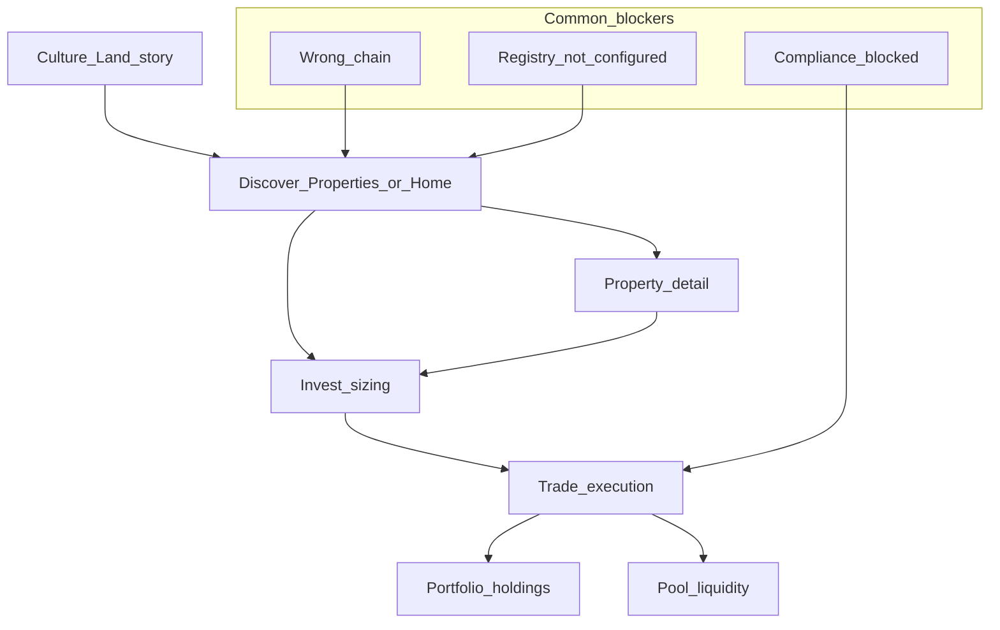

# Platform readiness audit (flows, gaps, backlog)

This is an **audit and roadmap**, not an implementation pass. It synthesizes the current codebase ([`web/src`](web/src)), existing Playwright coverage ([`web/e2e`](web/e2e)), and gaps visible from architecture (shell, legal, wallet, listings).

---

## 1. What is already tested (automated)

| Area | Spec file | What it proves |
|------|-----------|----------------|
| Route smoke | [`web/e2e/flows/routes-matrix.spec.ts`](web/e2e/flows/routes-matrix.spec.ts) | Many paths return OK + [`<main>`](web/e2e/helpers.ts) visible (or `/experience` immersive). **Does not** assert business logic, wallet, or forms. |
| Desktop nav + Finance | [`web/e2e/flows/navigation.spec.ts`](web/e2e/flows/navigation.spec.ts) | Properties, Culture Land, Community; Finance dropdown links to `/invest`, `/trade`, `/portfolio`, `/pool`, `/stake`. |
| Mobile drawer | [`web/e2e/flows/mobile-menu.spec.ts`](web/e2e/flows/mobile-menu.spec.ts) | Opens menu; reaches `/trade` via `a[href="/trade"]`. |
| Footer | [`web/e2e/flows/footer.spec.ts`](web/e2e/flows/footer.spec.ts) | Immersive story + legal overview links. |
| Experience | [`web/e2e/flows/experience.spec.ts`](web/e2e/flows/experience.spec.ts) | `/experience` region visibility (subset of immersive UX). |

**Not covered by E2E today:** wallet connect/switch, SIWE session, Veriff KYC, primary-sale purchase path, pool add/remove liquidity, stake transactions, community tasks/referrals API, profile flows, admin gates, issuer API success/failure, `?property=` deep links across invest/trade, chain-specific empty states.

---

## 2. Critical user journeys (manual / break risk)

| Journey | Primary surfaces | Failure modes (observed patterns in code) |
|---------|------------------|---------------------------------------------|
| Browse → diligence | [`/properties`](web/src/app/properties/page.tsx), [`/properties/[id]`](web/src/app/properties/[id]/page.tsx) | Demo fallback vs live registry messaging; user must infer env from banners. |
| Story → trust | [`/culture-land`](web/src/app/culture-land/page.tsx), [`/mission`](web/src/app/mission/page.tsx), [`/transparency`](web/src/app/transparency/page.tsx) | Transparency **removed from header** ([navbar plan](file:///Users/poker.vibe/.cursor/plans/navbar_cleanup_strategy_1b595ba8.plan.md)) — fine for simplicity, but **LPs often expect fees/contracts one click from invest**; mitigated only if footer/learn paths are obvious. |
| Size position | [`/invest`](web/src/app/invest/page.tsx) | Requires listings + demo metadata; `Web3TradeGuard` + primary-sale banner when unbound. |
| Execute | [`/trade`](web/src/app/trade/TradePageInner.tsx) | Tabs + `market=` param; pool may be empty; primary panel empty if no `primary-sales.json` binding. |
| Holdings | [`/portfolio`](web/src/app/portfolio/page.tsx) | Little value until wallet connected **and** balances &gt; 0; yield section is roadmap copy. |
| Issuer / sponsor | [`/issuer`](web/src/app/issuer/page.tsx) | **Operator-first** (JSON metadata, encrypt bundle) — weak as a **sales** surface for institutional sponsors without a separate “Partner with us” narrative ([`/build-with-us`](web/src/app/build-with-us/page.tsx) exists but is not wired as primary CTA from nav). |

---

## 3. Product and presentation gaps (sales / LP lens)

**Trust and narrative**

- Strong homepage and Culture Land story ([`page.tsx`](web/src/app/page.tsx), manifesto strip) — good anchor.
- **Missing for “close the room”:** explicit **issuer roster** (who stands behind each asset), **document room** deep-link per property (you have [`/documents`](web/src/app/documents/page.tsx) but property pages may not consistently tie to offering docs), **single PDF one-pager** or download CTA per deal.
- **Human touchpoint:** no prominent **“Talk to us” / calendar / concierge email** on invest or property detail (only scattered links like feedback, build-with-us). High-ticket real estate distribution usually requires **scheduled calls** and **data room** access.

**Conversion mechanics**

- Clear primary CTAs exist (Invest, View Details, Finance menu) — good after navbar cleanup.
- **Missing:** progressive profiling (accredited investor acknowledgment where legally required), **saved properties / watchlist** (even localStorage), **email capture** for non-wallet users (privacy-sensitive — must align with [`legal/privacy`](web/src/app/legal/privacy/page.tsx)).

**Compliance vs sale**

- Repeated “not investment advice” and reference economics — **correct** for risk management.
- **Gap:** balance disclaimers with **issuer-controlled offering summary** placeholders on each listing (even static) so the app feels **disclosure-led**, not only “demo math.”

---

## 4. Technical and reliability gaps

| Gap | Evidence / impact |
|-----|-------------------|
| No root [`error.tsx`](web/src/app) / [`not-found.tsx`](web/src/app) | Unhandled errors and 404s fall through to default Next behavior — weaker branded recovery. |
| No automated **accessibility** suite | No `axe` / `@axe-core/playwright` in CI — regression risk for WCAG claims. |
| **Analytics** | Privacy page notes optional operator analytics — **no default product funnel metrics** (unless added elsewhere), limiting iteration. |
| **API tests** | Auth, referral, KYC webhooks, issuer apply — not visible in [`e2e`](web/e2e); rely on manual or separate backend tests. |
| **Wallet E2E** | Real transactions rarely in CI; need **Synpress** or mocked wagmi / forked chain for meaningful regression. |

---

## 5. Recommended additions (prioritized)

**P0 — Trust + don’t embarrass in a live demo**

1. Branded **`not-found`** and **`error`** boundaries with links back to `/properties` and `/culture-land`.
2. **Smoke E2E** for Finance menu + one **deep link** (`/trade?property=1`) after nav refactor (assert tab or panel visible, not 500).
3. **Cross-link Transparency** from Invest/Trade banner strip (small text link) so compliance story stays discoverable without cluttering header.

**P1 — Sales-grade presentation**

4. Property detail **“Deal room”** strip: offering summary, key dates, link to `/documents` + `/legal/offerings`, contact CTA.
5. **Contact / book** module (Calendly embed or `mailto:` + structured office hours) on `/properties`, `/invest`, `/build-with-us`.
6. **Watchlist** (local or account-backed later) for returning visitors.

**P2 — Institutional and engineering maturity**

7. **Analytics** (privacy-reviewed): page funnel, CTA clicks, wallet connect starts/completions.
8. **Contract/API integration tests** for critical POST routes (`issuer`, auth, webhooks).
9. **Synpress or chain-mock E2E** for one happy-path: connect → approve → mock swap (heavy lift).

---

## 6. “Every button” reality check

Exhaustive click-state enumeration is **not** in CI; it would require **hundreds** of tests and wallet infrastructure. The professional approach is:

- **Matrix:** route smoke (already) + **10–15 journey tests** (discover → detail → invest → trade link; finance menu; footer legal; mobile drawer).
- **Manual script:** run before big demos: registry env, Base chain, seeded properties, primary-sales JSON, USDC on wallet, pool seeded, compliance not blocking.

---

## 7. Summary

The app already has a **strong marketing spine** (home, Culture Land, properties hub, invest/trade split, legal pages). To “win” at institutional quality, close the gaps around **recoverable errors**, **discoverable compliance**, **human sales touchpoints**, **per-deal documentation**, and **measurable conversion** — then deepen **automated tests** where they buy the most confidence (nav, deep links, optional wallet-mocked flows).
