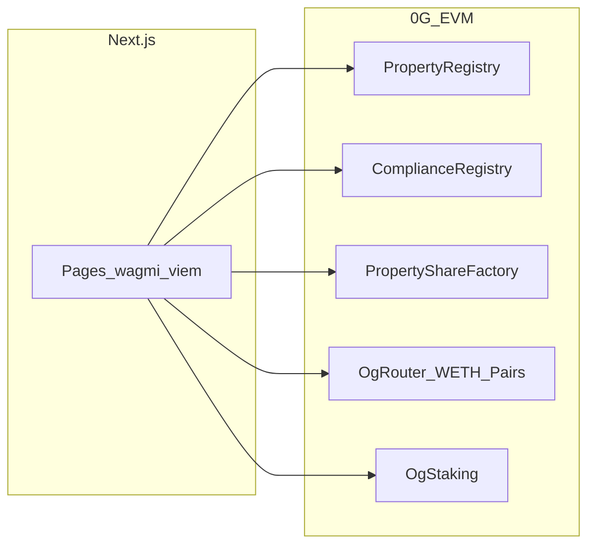

# Building Culture — Real estate on Base

Solidity (Foundry) + Next.js 15 for a **real-estate-focused** stack on **Base** (EVM L2): on-chain property registry, compliance-aware share tokens, AMM (WETH ↔ shares), optional lending and prediction markets, **native ETH staking** with cooldown, and a production-style web app (WalletConnect, wrong-chain banner, investor hub, admin panel).

Off-chain artifacts (documents, rich media) use HTTPS/IPFS-style storage patterns as configured per deployment; hashes and commitments anchor on-chain. Product and compliance context: [docs/domain-model.md](docs/domain-model.md), [docs/compliance.md](docs/compliance.md), [docs/grants.md](docs/grants.md).

---

## Table of contents

1. [Features](#features)
2. [Repository layout](#repository-layout)
3. [Prerequisites](#prerequisites)
4. [Quick start](#quick-start)
5. [Architecture](#architecture)
6. [Smart contracts](#smart-contracts)
7. [Deploying](#deploying)
8. [Web application](#web-application)
9. [Troubleshooting](#troubleshooting)
10. [Grant / demo checklist](#grant--demo-checklist)
11. [Contributing & license](#contributing--license)
12. [Publishing to GitHub](#publishing-to-github)

---

## Features

| Area | What you get |
|------|----------------|
| **Registry** | `PropertyRegistry` — property IDs, hashed external refs, document root anchors |
| **Compliance** | `ComplianceRegistry` + **Chainlink ACE adapter** (`ChainlinkAceAdapter`) |
| **Shares** | `RestrictedPropertyShareToken` — **uRWA** surface (`canSend`/`canReceive`/`canTransfer`, freeze) |
| **DTA** | `PropertyShareDTA` — NAV-priced subscribe + redeem queue |
| **PoR** | `PropertyReserveFeed` — mint caps vs attested backing |
| **Oracles** | `ChainlinkPriceOracle` (production); `MockPriceOracle` deprecated on mainnet |
| **DeFi** | `OgRouter`, optional `SimpleLendingPool` (IPriceOracle; **not live on mainnet** until NAV+PoR) |
| **Web** | buildingculture.capital — invest, trade, KYC webhook → onchain verify |

**Chainlink alignment:** [docs/standards/chainlink-alignment-v1.md](docs/standards/chainlink-alignment-v1.md) (REOC profile D). Matrix: [../../docs/CHAINLINK_RWA_COMPLIANCE.md](../../docs/CHAINLINK_RWA_COMPLIANCE.md).

---

## Repository layout

```text
./
├── src/                    # Solidity contracts (Foundry)
├── test/                   # Forge tests (incl. test/chainlink/*)
├── script/                 # DeployAll, DeployChainlinkModules, …
├── deployments/          # testnet.json (gitignored) — copy from testnet.example.json
├── docs/                   # Domain model, compliance, grants, token standard
├── scripts/                # sync_web_env.py — JSON → web/.env.local lines
└── web/                    # Next.js 15 app (see web/README.md)
```

---

## Prerequisites

- **Foundry** (`forge`, `cast`) — [getfoundry.sh](https://book.getfoundry.sh/getting-started/installation)
- **Node.js 20+** and **npm** (for the web app)
- A wallet with **testnet OG** — [faucet.0g.ai](https://faucet.0g.ai/)
- **Solc 0.8.24**, **EVM Cancun**, `via_ir = true` — see [foundry.toml](foundry.toml)

---

## Quick start

### Contracts

```bash
forge build
forge test
forge test --match-path 'test/chainlink/*'   # uRWA, DTA, PoR, ACE adapter
```

### Web app

```bash
cd web
cp .env.local.example .env.local
# Fill addresses manually, or from repo root after saving deployments/testnet.json:
# python3 scripts/sync_web_env.py deployments/testnet.json > web/.env.local

npm install
npm run dev
```

Open [http://localhost:3000](http://localhost:3000).

**Optional:** `OPENAI_API_KEY` in `web/.env.local` powers the AI assistant on `/guide`.

---

## Architecture



- **Browser** talks to RPC via **wagmi/viem**; addresses come from `NEXT_PUBLIC_*` env vars.
- **Restricted shares** consult `ComplianceRegistry` for transfers and verified users.
- **Staking** is **separate** from property share economics unless you integrate them later ([docs/domain-model.md](docs/domain-model.md)).

---

## Smart contracts

| Module | Contracts |
|--------|-----------|
| Core | `PropertyRegistry`, `PurchaseEscrow` |
| Compliance | `ComplianceRegistry` |
| Tokenization | `PropertyShareFactory` → **`RestrictedPropertyShareToken`** ([docs/token-standard.md](docs/token-standard.md)) |
| DeFi | `WETH9`, `OgFactory`, `OgPair`, `OgRouter`, `MockPriceOracle`, `SimpleLendingPool`, `BinaryPredictionMarket` |
| Staking | `OgStaking` |
| NFT (optional) | `PropertyShareProof` |

---

## Deploying

Full stack (includes `PropertyShareProof`, `OgStaking`):

```bash
export PRIVATE_KEY=0x...
# Optional: export NFT_BASE_URI=https://your.app/api/nft/
# Optional: export STAKING_COOLDOWN_SECONDS=3600

forge script script/DeployAll.s.sol:DeployAllScript \
  --rpc-url https://evmrpc-testnet.0g.ai \
  --broadcast
```

Copy logged addresses into `deployments/testnet.json` (start from [deployments/testnet.example.json](deployments/testnet.example.json)), then seed demo properties per [deployments/README.md](deployments/README.md).

**Explorer:** [chainscan-galileo.0g.ai](https://chainscan-galileo.0g.ai/)

---

## Web application

Detailed env vars, routes, and scripts: **[web/README.md](web/README.md)**.

Generate env from deployment JSON:

```bash
python3 scripts/sync_web_env.py deployments/testnet.json > web/.env.local
```

| Script | Purpose |
|--------|---------|
| `npm run dev` | Development server |
| `npm run build` | Production build |
| `npm run lint` | ESLint |

---

## Troubleshooting

### Styles look missing or the page flashes blank when navigating

1. **Root cause (fixed in repo):** Do not put **`animate-page-in`** (or any animation that sets **`opacity: 0`** in keyframe `0%`) on the **persistent `<main>`** in the root layout. Client-side route changes can **restart** the CSS animation and briefly (or visibly) apply **`opacity: 0`** to the entire main column — it looks like “CSS disappeared.” The root layout uses a plain `<main>` without that animation; keep entrance motion on **page-specific** blocks (e.g. home hero) only.

2. **Clean Next.js cache** if builds act strange:

   ```bash
   rm -rf web/.next web/node_modules/.cache
   cd web && npm run build
   ```

3. **`porto/internal` webpack warnings** — optional peer of `@wagmi/connectors`; [web/next.config.ts](web/next.config.ts) aliases shims. Safe to ignore unless you add the Porto connector.

4. **Wrong chain** — use the in-app **Switch to 0G Galileo** banner; ensure `NEXT_PUBLIC_OG_RPC` matches your network.

---

## Grant / demo checklist

- **Narrative:** [docs/grants.md](docs/grants.md)
- **Verify:** `forge test` and `cd web && npm run build`
- **Legal:** [docs/compliance.md](docs/compliance.md) + in-app `/legal`

---

## Contributing & license

- Match existing **Solidity** and **TypeScript** style; keep changes focused.
- Run **`forge test`** and **`cd web && npm run lint`** before opening a PR.
- License: see the repository’s **LICENSE** file if present; otherwise confirm with maintainers.

---

## Publishing to GitHub

The repo may not have `git` initialized yet. From the project root:

```bash
git init
git add .
git commit -m "Initial commit: Building Culture 0G real estate stack"
```

Create a **new empty repository** on GitHub (no README/license if you want a clean history), then:

```bash
git branch -M main
git remote add origin https://github.com/YOUR_USER/YOUR_REPO.git
git push -u origin main
```

Use **SSH** if you prefer: `git@github.com:YOUR_USER/YOUR_REPO.git`.

**Do not commit** secrets: `deployments/testnet.json` with real keys, `.env`, or `web/.env.local` — they are listed in [.gitignore](.gitignore).

---

## Further reading

| Doc | Topic |
|-----|--------|
| [docs/standards/reoc-v1.md](docs/standards/reoc-v1.md) | **REOC v1** — Real Estate On Chain (normative) |
| [docs/standards/chainlink-alignment-v1.md](docs/standards/chainlink-alignment-v1.md) | REOC profile D + Chainlink |
| [docs/oracle-migration-mainnet.md](docs/oracle-migration-mainnet.md) | Replace MockPriceOracle |
| [docs/mainnet-kyc-ops.md](docs/mainnet-kyc-ops.md) | KYC webhook + disable kycBypass |
| [docs/domain-model.md](docs/domain-model.md) | On-chain vs 0G Storage |
| [docs/token-standard.md](docs/token-standard.md) | og-RE-share implementation notes |
| [docs/0g-network.md](docs/0g-network.md) | 0G network notes |
| [docs/compliance.md](docs/compliance.md) | Compliance posture |
| [deployments/README.md](deployments/README.md) | Deploy + seed workflow |

## Foundry

https://book.getfoundry.sh/
