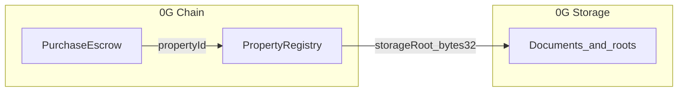

# Domain model: on-chain vs 0G Storage

**Normative identity and registry rules** for REOC are defined in **[standards/reoc-v1.md](./standards/reoc-v1.md) §2 (L1)**. This document describes how this repository maps those concepts to **0G Chain** contracts and **0G Storage** blobs without repeating L1 MUST rules.

## Identifiers

| Concept | Representation | Notes |
|--------|----------------|-------|
| **Property ID** | `uint256` from `PropertyRegistry` | Sequential ID; canonical handle for on-chain references. |
| **External parcel reference** | `bytes32 externalRefHash` | `keccak256` of a jurisdiction-specific string (e.g. county + APN) so the raw string is not stored on-chain. |
| **0G Storage root** | `bytes32` (Merkle root) | From 0G Storage SDK after upload; stored on-chain as a commitment. |

## On 0G Chain (smart contracts)

Stored in `PropertyRegistry` / `PurchaseEscrow`:

- Property existence and **record owner** (application-level ownership of the registry record, not legal title).
- **Hashes** of external ref, optional metadata summary, and per-document **storage roots** (deed, disclosure, inspection, etc.).
- Escrow state: seller, buyer, price, deadline, funded / completed / cancelled.

**Not** stored on-chain (by design for this MVP):

- Raw PII, full legal descriptions, unencrypted PDFs.
- Plaintext parcel identifiers (use `externalRefHash`).

## 0G Storage (blobs / KV)

- Original documents (PDFs, images), large payloads, optional encrypted blobs.
- After upload, persist **root hash** (and tx hashes if needed) returned by the SDK; commit those hashes on-chain via `addDocument` / metadata updates.

## Staking (native OG)

`OgStaking` is **separate** from property share economics: users stake **native OG** for emission-style rewards (funded by `notifyRewardAmount`) and exit via a **cooldown** before principal is returned. It does not represent equity in a property or SPV unless you explicitly link flows in a future version.

## Linking flow

1. **Register** property on-chain → receive `propertyId`.
2. **Upload** documents to 0G Storage → obtain Merkle **root hash** per file or bundle.
3. **Anchor** each root on-chain with `addDocument(propertyId, docKind, storageRoot)`.
4. **Open escrow** referencing `propertyId`; native token amount held in `PurchaseEscrow` until `release` or cancel.

## Doc kind labels (`bytes32`)

Use fixed keccak labels in app code, e.g.:

- `keccak256("DEED")`
- `keccak256("DISCLOSURE")`
- `keccak256("INSPECTION")`

The contract only stores opaque `bytes32`; human-readable names belong in your app layer. REOC L3 metadata uses string enums (`DEED`, `DISCLOSURE`, …) in [`schemas/reoc-metadata-v1.json`](./schemas/reoc-metadata-v1.json) for off-chain interchange; map consistently to on-chain `docKind` in your deployment.
