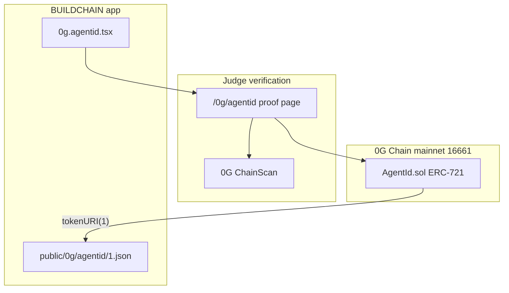

# BUILDCHAIN Agent ID on 0G (judge README)

**0G APAC Hackathon** submission. HackQuest: [0G APAC Hackathon](https://www.hackquest.io/hackathons/0G-APAC-Hackathon)

| Field | Value |
|-------|--------|
| **Track** | Agentic Infrastructure & OpenClaw Lab (Track 1) — on-chain Agent ID primitive |
| **0G components** | **0G Chain** (mainnet `16661`) + **Agent ID** (ownable ERC-721) |
| **Live proof** | [app.buildingcultureid.space/0g/agentid](https://app.buildingcultureid.space/0g/agentid) |
| **Contract** | `0x0451b1d37058ad57df22d7185aabc6b0a36fc41e` |
| **Explorer** | [ChainScan contract](https://chainscan.0g.ai/address/0x0451b1d37058ad57df22d7185aabc6b0a36fc41e#code) |

Copy/paste pack for operators: [0G_HACKATHON_SUBMISSION.md](./0G_HACKATHON_SUBMISSION.md) · Video + X: [0G_HACKATHON_VIDEO_AND_X.md](./archive/0G_HACKATHON_VIDEO_AND_X.md)

---

## What we're building

We're building **BUILDCHAIN Agent ID**, an on-chain identity layer for AI agents on the 0G Chain. Using ERC-721, agents receive portable, user-owned identities that can be verified and integrated across decentralized applications.

This hackathon submission deploys that primitive on **0G Chain mainnet** (`16661`) and exposes an in-app proof lane so judges can verify deploy and mint in under one minute.

## Architecture



| Layer | Path | Role |
|-------|------|------|
| Contract | `b3/contracts/src/AgentId.sol` | Ownable mint, `setBaseURI`, `tokenURI` |
| Deploy | `b3/contracts/script/DeployAgentId.s.sol` | Broadcast deploy + mint token `#1` |
| Proof UI | `b3/app/src/routes/0g.agentid.tsx` | Contract, txs, copy buttons, demo script |
| Shared copy | `b3/app/src/lib/og-hackathon.ts` | Defaults, X post, HackQuest field text |
| Metadata | `b3/app/public/0g/agentid/1.json` | ERC-721 metadata for minted token `#1` |

## 0G integration (how it works)

1. **Deploy** `AgentId` to 0G mainnet RPC `https://evmrpc.0g.ai` (chainId `16661`).
2. **Mint** token `#1` to the deployer (see mint tx on the proof page).
3. **tokenURI** resolves to `{baseURI}{tokenId}.json` — served from the app at `/0g/agentid/1.json`.
4. **Proof page** surfaces contract address, deploy tx, mint tx, and ChainScan deep links (no mock data).

### On-chain proof

| Item | Value |
|------|--------|
| Contract | `0x0451b1d37058ad57df22d7185aabc6b0a36fc41e` |
| Deploy tx | `0x4629018662bf4f8f1cf6438c749d56307c1fcb4aa79e044f8692c31c88572d3e` |
| Mint tx | `0xf920a643320272e067b137e11b85f07afe40e4dfb820e3de3754d68dc945d7d9` |

## Reproduce locally (&lt; 5 minutes)

**Requirements:** Node 20+, npm. Postgres is **not** required for `/0g/agentid`.

```bash
git clone https://github.com/Laszlo23/xrpbaby.git
cd xrpbaby/b3/app
npm install
npm run dev
```

Open **http://localhost:5173/0g/agentid** — ChainScan links and copy buttons should work immediately (env defaults in `og-hackathon.ts`).

### Contract tests

```bash
cd ../contracts
forge test --match-contract AgentId
```

### Optional: verify source on ChainScan

```bash
cd b3/contracts
export ETHERSCAN_API_KEY="your-chainscan-api-key"
./scripts/verify-agentid-0g.sh
```

See [0G deploy docs](https://docs.0g.ai/developer-hub/building-on-0g/contracts-on-0g/deploy-contracts). Verification API: `https://chainscan.0g.ai/open/api`.

## HackQuest form — copy/paste (≤300 characters)

**Which 0G components?** (checkboxes)

- 0G Chain
- Agent ID

**0G On-Chain Integration Proof**

```
AgentId ERC-721 on 0G mainnet (16661). Contract: 0x0451b1d37058ad57df22d7185aabc6b0a36fc41e. Explorer: https://chainscan.0g.ai/address/0x0451b1d37058ad57df22d7185aabc6b0a36fc41e#code. Live proof: https://app.buildingcultureid.space/0g/agentid
```

**GitHub Repository Link**

```
https://github.com/Laszlo23/xrpbaby — Judge README: b3/docs/0G_HACKATHON_JUDGE_README.md. Repro: cd b3/app && npm i && npm run dev → /0g/agentid. Contract: b3/contracts/src/AgentId.sol
```

**Contract Address field:** `0x0451b1d37058ad57df22d7185aabc6b0a36fc41e`

## Demo video & X (operator)

| Deliverable | Status | Action |
|-------------|--------|--------|
| Demo video ≤3 min | Paste URL in submission doc | [0G_HACKATHON_VIDEO_AND_X.md](./archive/0G_HACKATHON_VIDEO_AND_X.md) |
| Public X post | Paste tweet URL in submission doc | Use **Copy X post** on proof page |
| HackQuest submit | — | [HackQuest project form](https://www.hackquest.io/hackathons/0G-APAC-Hackathon) |

## Roadmap (post-hackathon, optional)

- Bind Agent ID to `/.well-known/agent.json` and x402 trading SKUs ([TRADING_AGENT_SUGAR.md](./TRADING_AGENT_SUGAR.md))
- Persist agent manifests on **0G Storage** and reference roots from `tokenURI`

**Note:** The same `b3/` app hosts other Building Culture modules (e.g. `/studio`, ecosystem landing). For this hackathon, verify only `/0g/agentid` and `AgentId.sol` — see [0G_HACKATHON_SUBMISSION.md](./0G_HACKATHON_SUBMISSION.md) §9.

## Copy for forms

**Project name:** BUILDCHAIN Agent ID

**One-sentence (≤30 words):**

> BUILDCHAIN Agent ID: ERC-721 on 0G Chain gives AI agents portable, user-owned identities verifiable across decentralized applications.

**Technical one-liner (demo close):**

> This ERC-721 is our Agent ID primitive on 0G Chain mainnet; ownership is the identity anchor.
