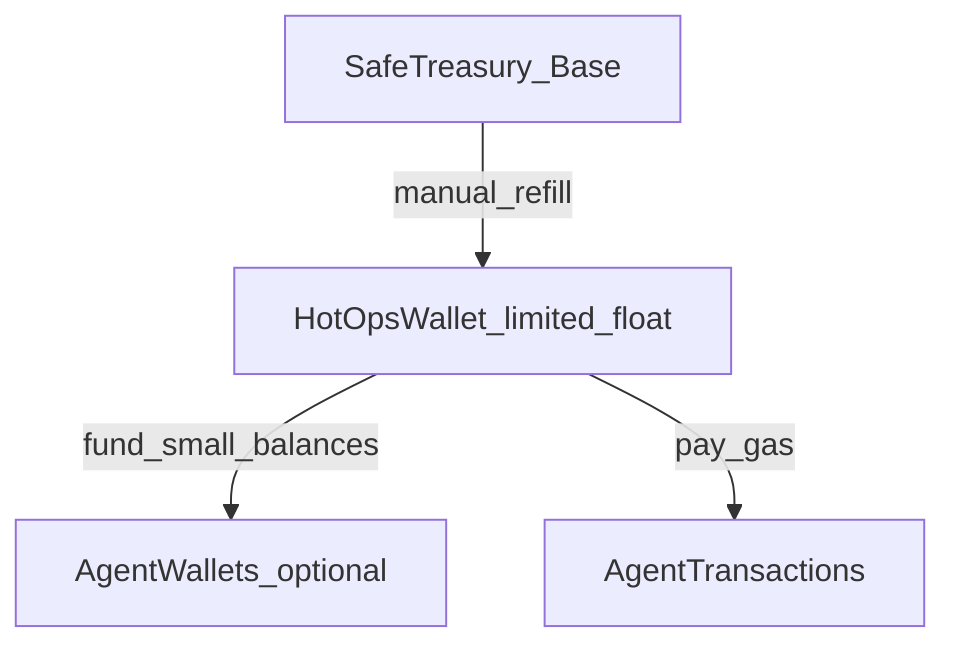

# Agent funding runbook (Safe → HotOps → Agent wallets)

This runbook defines how to fund on-chain agent activity on **Base (8453)** while keeping protocol-owned funds behind the canonical Safe.

## Goals

- **Protocol reserves** remain in the canonical Safe (multisig).
- Agents transact from a **limited-float HotOps wallet** (and optionally per-agent wallets) funded by **manual refills** from the Safe.
- Any suspected compromise triggers an **incident-first** response (pause agents, rotate keys).

## Canonical addresses

- **Treasury Safe (Base 8453)**: `0xCe03F6E734cC48393Ce41b257E998c68b521EB5c` (source of truth: `docs/TREASURY_POLICY.md`)
- **HotOps wallet (Base 8453)**: create a dedicated wallet for agent operations; keep balance capped.

## Funding model

### HotOps wallet rules (recommended defaults)

- **Float cap**: decide a maximum HotOps balance (e.g. 0.05–0.25 ETH on Base depending on volume).
- **Refill threshold**: when HotOps falls below a low-water mark, refill back to the cap.
- **No custody creep**: HotOps is for gas + small operational value only. Protocol reserves stay in the Safe.

## Operator procedure (manual refill)

1. **Verify Safe**
   - Confirm owners and threshold in Safe UI match expectations.
   - Confirm there are no unexpected pending transactions.
2. **Check HotOps balance**
   - Confirm HotOps balance is below your refill threshold.
3. **Create Safe transfer**
   - Transfer amount = `(float_cap - current_hotops_balance)`, capped by your maximum refill amount.
4. **Record the refill**
   - Append an entry to `ops/SAFE_REFILL_LOG.md` with the tx hash and purpose.
5. **Post-refill verification**
   - Confirm HotOps received funds and can pay for expected agent gas.

## Agent wallet options

### Option A — single HotOps wallet (simplest)

- All agent transactions are signed from HotOps.
- Pros: minimal complexity.
- Cons: largest blast radius; accounting is coarser.

### Option B — per-agent wallets funded by HotOps (recommended for multiple agents)

- Maintain separate EOAs per agent; each funded from HotOps for a narrow purpose.
- Pros: better blast-radius isolation and accounting.
- Cons: more key management.

If you use per-agent wallets, store **addresses only** (no secrets) in `ops/AGENT_WALLET_INVENTORY.md` and keep private keys outside the repo (see `ops/AGENT_KEYS.md` for key generation).

## Kill-switch and incident response

- **Kill-switch**: set `AGENTS_PAUSED=true` in the agent runtime env (`/etc/bc-agent-tick.env`) to halt ticks.
- **Incident response**: follow `docs/INCIDENT_RUNBOOK.md` for suspected secret leaks or abnormal treasury/agent activity.

## Notes for econ-live agents

For agents that can submit transactions (e.g. `ags-distributor-1`), keep `ECON_LIVE=false` until:

- funding is confirmed,
- caps in `ops/agents.json` are reviewed (`perTxAgsCap`, `monthlyAgsCap`, `dailyGasCapWei`, etc.),
- and monitoring is in place (`/agent-fleet`, `GET /api/agents/status`).

