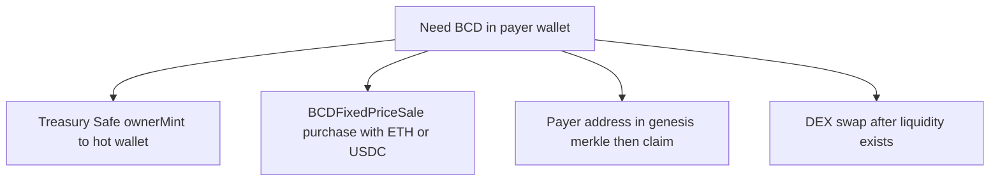

# BCD payer wallet — chain verification, funding paths, Farcaster payouts

Operational companion to [`BCD_PRELAUNCH_RUNBOOK.md`](BCD_PRELAUNCH_RUNBOOK.md) for funding a **hot wallet** that pays players or rewards on **Base**.

## 1. Canonical addresses (repo source of truth)

From [`contracts/deployments/8453.json`](../contracts/deployments/8453.json) and [`packages/contracts-sdk/src/generated/addresses.ts`](../packages/contracts-sdk/src/generated/addresses.ts):

| Contract | Base (8453) |
|----------|----------------|
| **BuildingCultureDollar (BCD)** | `0xda64dceb00b88ee1b8f6168beb58f5a2a7226b72` |
| **BCDGenesisClaim** | `0x2bae6b04d0d1c8016cc863509395b68eb0021f58` |

Production frontend may override the token via **`VITE_BCD_TOKEN_ADDRESS`** / **`VITE_BCD_CHAIN_ID`** — always reconcile deployed env with this table before treasury actions.

## 2. On-chain verification snapshot

Run [`scripts/verify-bcd-base-onchain.sh`](../scripts/verify-bcd-base-onchain.sh) after installing [Foundry](https://book.getfoundry.sh/) (`cast`). Default RPC: `https://mainnet.base.org` (override with `BASE_RPC_URL`).

**Snapshot (manual / script — values drift with chain state):** last exercised via `scripts/verify-bcd-base-onchain.sh` against `mainnet.base.org`.

| Read | Result | Notes |
|------|--------|--------|
| `symbol()` | `BCD` | Confirms ERC-20 identity at SDK address |
| `decimals()` | `18` | Matches [`BCD_TOKENOMICS_LAUNCH.md`](BCD_TOKENOMICS_LAUNCH.md) |
| `cap()` | `1_000_000 ether` (wei) | Matches deploy default |
| `owner()` | `0x502ce9FB1814cb03843967EC5E0D8F6AA3A3C2e1` | Treasury controls **`ownerMint`** while enabled |
| `totalSupply()` | `0` | Was zero at last script run — increases after mints |
| `genesisClaimContract()` | matches genesis row above | Checksummed equality with SDK |
| `ownerMintDisabled()` | revert | Getter missing or incompatible with current source — verify on [BaseScan](https://basescan.org/) |
| `fixedSaleContract()` | revert | Same; sale router may be unset or ABI differs |

Contract ABI for **`ownerMint`** / **`disableOwnerMintForever`** is defined in-repo; Safe txs must match live bytecode.

## 3. Choosing how to fund the payer wallet

Pick **one** primary path (compliance and treasury policy apply — not legal advice).

| Path | When to use | Requirements |
|------|-------------|--------------|
| **Treasury `ownerMint`** | Ops budget, contests, internal payer | Token **`owner`** (Safe) + **`ownerMintDisabled == false`** + supply under **`cap`** |
| **Fixed-price sale** | Buy like any user | Sale deployed and **`configureRound`** active; payer wallet holds **ETH** or **USDC (Base)** |
| **Genesis claim** | Allocation policy fits merkle | Address included in published tree; [`BCDGenesisClaim`](../contracts/src/BCDGenesisClaim.sol) rules |
| **Secondary / DEX** | No mint rights | Pool exists; swap **ETH/USDC → BCD** |

After mint or purchase, fund **gas** on the payer wallet (**ETH on Base**) for ERC-20 **`transfer`** calls to winners.

## 4. Farcaster game integration (player payouts)

The repo does **not** map Farcaster IDs to BCD transfers. Your game layer must:

1. **Resolve payout recipient** — each winner needs a **Base `0x…` address** (custody wallet, Warpcast-linked wallet, etc.). Typical patterns:
   - User connects wallet in mini-app / frame → store verified address for `fid`.
   - Use Neynar or similar to read **verified addresses** / custody expectations — **never** send mainnet tokens to an address the player did not approve.

2. **Execute payout** — standard **ERC-20 `transfer`** on chain **8453**:
   - Token: **`BuildingCultureDollar`** address (above or env override).
   - Amount: **wei** with **18 decimals** (`amount * 10n ** 18n` in JS).

3. **Operational safety** — separate **hot payer** with limited balance; refill from Safe via **`transfer`** from treasury or **`ownerMint`** to hot wallet per policy; monitor **`transfer`** failures (gas, blacklist, typos).

## 5. Related docs

- [`bcd-product-map.md`](bcd-product-map.md) — product flows
- [`BCD_TOKENOMICS_LAUNCH.md`](BCD_TOKENOMICS_LAUNCH.md) — caps and payment assets
- [`BCD_PRELAUNCH_RUNBOOK.md`](BCD_PRELAUNCH_RUNBOOK.md) — deploy / Safe / merkle
- [`ops/AGENT_PHASE0.md`](../ops/AGENT_PHASE0.md) — agent distributor funding (**not** BCD-specific unless you wire it explicitly)
