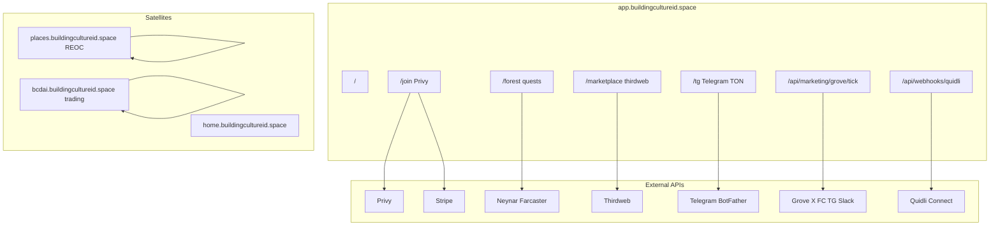

# Ecosystem Go-Live Runbook

Single checklist for launching the full Building Culture ecosystem at `app.buildingcultureid.space` and satellites.

**Related docs:** [GO_LIVE_COMMAND_PACK.md](./GO_LIVE_COMMAND_PACK.md) (copy/paste deploy commands), [TELEGRAM_MINIAPP_SETUP.md](./TELEGRAM_MINIAPP_SETUP.md), [MISSING_AND_FIXES.md](./MISSING_AND_FIXES.md).

## How to read this doc

| Tag | Meaning |
|-----|---------|
| **AGENT** | Cursor agent or operator can run scripts / deploy / fix code |
| **YOU** | Requires human dashboard, phone, treasury, or VPS access agents cannot use |

Run phases in order unless noted. Minimum viable launch = **Phase 0–2**. Full ecosystem = **Phase 0–5**.

## Ecosystem map



## Surfaces at a glance

| Surface | URL | Phase | Critical env |
|---------|-----|-------|--------------|
| Unified app | https://app.buildingcultureid.space | 1 | `DATABASE_URL`, `VITE_APP_ORIGIN`, Privy |
| Join / wallets | `/join` | 1 | `VITE_PRIVY_*`, `PRIVY_APP_SECRET` |
| Forest quests | `/forest` | 2 | `NEYNAR_*`, `VITE_NEYNAR_CLIENT_ID` |
| Telegram Mini App | `/tg` | 2 | `TELEGRAM_BOT_TOKEN`, TON `VITE_*` |
| Marketplace | `/marketplace` | 3 | `THIRDWEB_*`, `VITE_MARKETPLACE_*` |
| Grove tick | `/api/marketing/grove/tick` | 2 | `GROVE_*`, `GROVE_TELEGRAM_CHAT_ID` |
| Quidli webhook | `/api/webhooks/quidli` | 2 | `QUIDLI_API_KEY` + Connect dashboard |
| Places REOC | places.buildingcultureid.space | 4 | `COMPLIANCE_REGISTRY_*`, `VITE_PLACES_*` |
| BCDAI trading | bcdai.buildingcultureid.space | 5 | GCP deploy, `CORS_ORIGIN` |
| Ankommen AI | ankommen.buildingcultureid.space | 5 | nginx proxy to ankommen.ai (beta) |
| KinderStimme | forkids.buildingcultureid.space | 5 | nginx proxy to kinderstimme.at (beta) |
| BC Studio | /studio | 2 | `STUDIO_SANDBOX_*`, OpenAI/Anthropic |
| BCC liquidity learn | `/liquidity` | 2 | `VITE_BCC_*`; optional `VITE_BCC_AERODROME_*` |
| Stripe packs | `/join` checkout | 3 | `STRIPE_*`, `VITE_STRIPE_PUBLISHABLE_KEY` |

## What only you can do

These **cannot** be automated by agents:

- BotFather: `/setdomain`, Mini App URL confirm for `@buildingcultureappbot`
- Phone: Telegram → TON wallet → +50 XP end-to-end sign-off
- Dashboard secrets not yet pasted: Stripe, Grove X, `GROVE_NEYNAR_SIGNER_UUID`, `VITE_FARCASTER_TARGET_CAST_URL`
- Quidli Connect: webhook registration at [connect.quid.li](https://connect.quid.li/)
- VPS: nginx 301 cutover per `infra/nginx-unified-entry.example.conf`
- Places: compliance/KYC operator steps
- BCDAI: GCP deploy credentials
- Treasury: agent private keys; keep `XRPL_EXECUTION_ENABLED=0` for launch

---

## Phase 0 — Env foundation

- [ ] **Step 0.1** — Canonical `deploy/.env` exists
  - **Owner:** AGENT
  - **Command:** `test -f deploy/.env && echo ok`
  - **Pass when:** `deploy/.env` present (copy from `deploy/.env.example` if new)

- [ ] **Step 0.2** — Template documents all integration blocks
  - **Owner:** AGENT
  - **Command:** `diff -u deploy/.env.example <(grep -E '^[A-Z]' deploy/.env | cut -d= -f1 | sort -u) || true`
  - **Pass when:** `deploy/.env.example` includes Telegram, TON, Grove, Quidli, Thirdweb, Places, Stripe sections

- [ ] **Step 0.3** — Sync VITE + mirror pairs
  - **Owner:** AGENT
  - **Command:** `npm run sync:vite-env`
  - **Pass when:** `app/.env` matches `deploy/.env`; origins and Telegram URLs set

- [ ] **Step 0.4** — Marketplace env synced
  - **Owner:** AGENT
  - **Command:** `npm run market:env`
  - **Pass when:** `VITE_MARKETPLACE_CONTRACT_ADDRESS` and `THIRDWEB_SECRET_KEY` in `deploy/.env`

- [ ] **Step 0.5** — Full env audit
  - **Owner:** AGENT
  - **Command:** `npm run audit:env`
  - **Pass when:** Phase 0–2 integrations show OK; optional gaps (Stripe, Places) listed as WARN only

- [ ] **Step 0.6** — VITE structure audit
  - **Owner:** AGENT
  - **Command:** `npm run audit:vite-env`
  - **Pass when:** No missing **critical** `VITE_*` in deploy + app

- [ ] **Step 0.7** — Paste Privy secrets
  - **Owner:** YOU
  - **Pass when:** `PRIVY_APP_SECRET`, `VITE_PRIVY_APP_ID`, `VITE_PRIVY_CLIENT_ID` set

- [ ] **Step 0.8** — Paste Thirdweb secret
  - **Owner:** YOU
  - **Pass when:** `THIRDWEB_SECRET_KEY` matches Thirdweb project for client ID `0e78cdd2…`

- [ ] **Step 0.9** — Paste Neynar key
  - **Owner:** YOU
  - **Pass when:** `NEYNAR_API_KEY`, `NEYNAR_CLIENT_ID`, `VITE_NEYNAR_CLIENT_ID` set

- [ ] **Step 0.10** — Paste Telegram bot token
  - **Owner:** YOU
  - **Pass when:** `TELEGRAM_BOT_TOKEN` set; bot is `@buildingcultureappbot`

- [ ] **Step 0.11** — Paste Quidli API key
  - **Owner:** YOU
  - **Pass when:** `QUIDLI_API_KEY` set (server-only, never `VITE_*`)

- [ ] **Step 0.12** — Stripe keys (if culture packs wanted)
  - **Owner:** YOU
  - **Pass when:** `STRIPE_SECRET_KEY`, `STRIPE_WEBHOOK_SECRET`, `VITE_STRIPE_PUBLISHABLE_KEY` set; or skip Phase 3 Stripe steps

- [ ] **Step 0.13** — Places contract addresses (if REOC launch)
  - **Owner:** YOU
  - **Pass when:** `COMPLIANCE_REGISTRY_ADDRESS`, `VITE_PLACES_*` set after REOC deploy

---

## Phase 1 — Unified app production

- [ ] **Step 1.1** — CI / local verify green
  - **Owner:** AGENT
  - **Command:** `npm run verify:app`
  - **Pass when:** lint, typecheck, build pass

- [ ] **Step 1.2** — Prisma migrate on production DB
  - **Owner:** AGENT
  - **Command:** `npx prisma migrate deploy` (with prod `DATABASE_URL` on VPS or tunneled)
  - **Pass when:** migrations applied, no pending

- [ ] **Step 1.3** — Rebuild and deploy web image
  - **Owner:** AGENT
  - **Command:** `npm run deploy:grove`
  - **Pass when:** Docker build succeeds; `buildingculture-web-1` healthy

- [ ] **Step 1.4** — Production smoke
  - **Owner:** AGENT
  - **Command:** `npm run smoke:production`
  - **Pass when:** core routes return 200

- [ ] **Step 1.5** — Growth audit (full gate)
  - **Owner:** AGENT
  - **Command:** `npm run growth:audit`
  - **Pass when:** smoke + Telegram + Grove sections pass

- [ ] **Step 1.6** — Landing and join load
  - **Owner:** AGENT
  - **Pass when:** `/` and `/join` load; Privy modal opens

- [ ] **Step 1.7** — Strapi token (if CMS routes used)
  - **Owner:** YOU
  - **Pass when:** `STRAPI_API_TOKEN` set or CMS features disabled

- [ ] **Step 1.8** — nginx unified entry / 301
  - **Owner:** YOU
  - **Command:** Apply `infra/nginx-unified-entry.example.conf` on VPS
  - **Pass when:** legacy hosts 301 to `app.buildingcultureid.space` per `MISSING_AND_FIXES.md`

---

## Phase 2 — Growth lane

- [ ] **Step 2.1** — Telegram bot menu → Mini App
  - **Owner:** AGENT
  - **Command:** `npm run tg:setup`
  - **Pass when:** menu button URL is `https://app.buildingcultureid.space/tg`

- [ ] **Step 2.2** — BotFather domain
  - **Owner:** YOU
  - **Command:** In @BotFather: `/setdomain` → `@buildingcultureappbot` → `app.buildingcultureid.space`
  - **Pass when:** Mini App opens inside Telegram without `missing_init_data`

- [ ] **Step 2.3** — Phone test: bot → TON → XP
  - **Owner:** YOU
  - **Pass when:** Open https://t.me/buildingcultureappbot → connect TON → +50 XP credited

- [ ] **Step 2.4** — Quidli webhook registered
  - **Owner:** YOU
  - **URL:** `https://app.buildingcultureid.space/api/webhooks/quidli`
  - **Pass when:** Connect dashboard shows webhook active

- [ ] **Step 2.5** — Farcaster like-cast quest URL
  - **Owner:** YOU
  - **Pass when:** `VITE_FARCASTER_TARGET_CAST_URL` set to Warpcast cast URL, or quest disabled in UI

- [ ] **Step 2.6** — Grove Telegram posting
  - **Owner:** AGENT
  - **Pass when:** `GROVE_TELEGRAM_CHAT_ID` set; Grove tick posts to BuildingCulture group

- [ ] **Step 2.7** — Grove multi-channel (optional)
  - **Owner:** YOU
  - **Pass when:** `GROVE_X_*`, `GROVE_NEYNAR_SIGNER_UUID`, `GROVE_SLACK_WEBHOOK_URL` set if X/FC/Slack growth wanted

- [ ] **Step 2.8** — Pin bot in Telegram group
  - **Owner:** YOU
  - **Pass when:** `https://t.me/buildingcultureappbot` pinned in community group

- [ ] **Step 2.9** — XRPL quote-only (no execution)
  - **Owner:** AGENT
  - **Pass when:** `XRPL_QUOTE_ENABLED=1`, `XRPL_EXECUTION_ENABLED=0`

- [ ] **Step 2.10** — Re-run growth audit after Phase 2 secrets
  - **Owner:** AGENT
  - **Command:** `npm run growth:audit`
  - **Pass when:** all gates green

---

## Phase 3 — Marketplace & payments

- [ ] **Step 3.1** — Thirdweb env synced before deploy
  - **Owner:** AGENT
  - **Command:** `npm run market:env && npm run audit:vite-env`
  - **Pass when:** marketplace `VITE_*` baked in last image

- [x] **Step 3.2** — `/marketplace` loads
  - **Owner:** AGENT
  - **Pass when:** browse UI loads; contract address matches Base deployment
  - **Verified 2026-06-05:** `GET /api/market/config` → `thirdwebConfigured: true`, contract `0x3af9EB7784C1843BD8385D1F41dE78d4B83AEcf4` on Base. Optional gaps: `platformFeeBps` / `feeRecipient` unset; trading agent sidecar unreachable in prod (`tradingAgentReachable: false`) — does not block marketplace browse.

- [ ] **Step 3.3** — Thirdweb dashboard match
  - **Owner:** YOU
  - **Pass when:** Thirdweb project client ID + secret match `deploy/.env`

- [ ] **Step 3.4** — Stripe products + webhook (optional)
  - **Owner:** YOU
  - **Pass when:** Stripe webhook → `/api/webhooks/stripe`; AGENT runs `npm run sync:vite-env` after keys pasted

- [ ] **Step 3.5** — Culture pack checkout test
  - **Owner:** YOU
  - **Pass when:** test purchase credits points (if Stripe enabled)

---

## Phase 4 — Places REOC satellite

- [ ] **Step 4.1** — Places vars in deploy
  - **Owner:** AGENT
  - **Command:** `npm run sync:vite-env` after operator adds Places block
  - **Pass when:** `VITE_PLACES_SITE_URL`, paths, `COMPLIANCE_REGISTRY_ADDRESS` set

- [ ] **Step 4.2** — Places DB + app deploy
  - **Owner:** AGENT
  - **Pass when:** per `apps/places` docs; schema migrated

- [ ] **Step 4.3** — KYC / compliance operator
  - **Owner:** YOU
  - **Pass when:** Chainlink ACE / issuer onboarding complete

- [ ] **Step 4.4** — `places.buildingcultureid.space` live
  - **Owner:** AGENT
  - **Pass when:** YOU confirms hosting target; DNS + deploy complete

- [ ] **Step 4.5** — Hub links to Places
  - **Owner:** AGENT
  - **Pass when:** unified app links resolve to Places paths

---

## Phase 5 — BCDAI + other satellites

- [ ] **Step 5.1** — CORS / SIWE include satellite hosts
  - **Owner:** AGENT
  - **Pass when:** `CORS_ORIGIN`, `SIWE_ALLOWED_DOMAINS` include `bcdai`, `home`, `eco`, etc.

- [ ] **Step 5.2** — BCDAI Cloud Run deploy
  - **Owner:** YOU
  - **Pass when:** `bcdai.buildingcultureid.space` reachable

- [ ] **Step 5.3** — WohnAI / home / eco static deploys
  - **Owner:** AGENT
  - **Pass when:** YOU confirms priority; deploy scripts run

- [ ] **Step 5.4** — Satellite smoke or “coming soon”
  - **Owner:** AGENT
  - **Pass when:** each satellite documented as live or deferred with date

---

## Phase 6 — Agent fleet (post-launch, optional)

- [ ] **Step 6.1** — Grove cron on VPS
  - **Owner:** AGENT
  - **Command:** `bc-grove-tick.timer` via `scripts/deploy-grove.sh`
  - **Pass when:** scheduled Grove ticks in logs

- [ ] **Step 6.2** — Trading agent health
  - **Owner:** AGENT
  - **Pass when:** `/api/trading/health` reachable or explicitly optional

- [ ] **Step 6.3** — 0G inference key
  - **Owner:** YOU
  - **Pass when:** `OG_COMPUTE_ROUTER_API_KEY` set if using paid 0G inference

- [ ] **Step 6.4** — On-chain agent keys
  - **Owner:** YOU
  - **Pass when:** treasury approves `AGENT_AGS_DISTRIBUTOR_PRIVATE_KEY` etc.; `ECON_LIVE` policy followed

- [ ] **Step 6.5** — Agent bootstrap vs live economics
  - **Owner:** AGENT
  - **Pass when:** `AGENTS_PAUSED`, `ECON_LIVE`, `AGENT_BOOTSTRAP_MODE` match `docs/TREASURY_POLICY.md`

---

## Success criteria

**Minimum live (Phase 0–2):**

- `npm run growth:audit` green
- Phone Telegram loop signed off (Step 2.3)
- Critical `VITE_*` set per `npm run audit:vite-env`
- Grove posting to Telegram on schedule

**Full ecosystem (Phase 0–5):**

- Above + Places hub links work + Places app deployed (or deferred)
- Marketplace browse works on production
- BCDAI satellite reachable or marked “coming soon”
- Appendix env matrix shows no missing **required** vars for chosen phases

---

## Appendix A — Env matrix

| Variable | Purpose | Client (VITE) | Phase | Who provides |
|----------|---------|---------------|-------|--------------|
| `DATABASE_URL` | Prisma / app DB | No | 0 | AGENT + YOU (password) |
| `PUBLIC_APP_ORIGIN` | Canonical URL | No | 0 | AGENT |
| `VITE_APP_ORIGIN` | Browser origin | Yes | 0 | AGENT |
| `VITE_PLATFORM_ORIGIN` | Platform links | Yes | 0 | AGENT |
| `VITE_PRIVY_APP_ID` | Privy app id | Yes | 0 | YOU |
| `VITE_PRIVY_CLIENT_ID` | Privy client | Yes | 0 | YOU |
| `PRIVY_APP_SECRET` | Server auth | No | 0 | YOU |
| `VITE_THIRDWEB_CLIENT_ID` | Marketplace SDK | Yes | 3 | YOU |
| `THIRDWEB_SECRET_KEY` | Server marketplace | No | 3 | YOU |
| `VITE_MARKETPLACE_CONTRACT_ADDRESS` | Listing contract | Yes | 3 | AGENT (`market:env`) |
| `VITE_MARKETPLACE_NETWORK` | Chain slug | Yes | 3 | AGENT |
| `TELEGRAM_BOT_TOKEN` | Mini App auth | No | 2 | YOU |
| `TELEGRAM_MINIAPP_URL` | Server mini app URL | No | 2 | AGENT (`sync:vite-env`) |
| `VITE_TELEGRAM_MINIAPP_URL` | Client mini app URL | Yes | 2 | AGENT |
| `VITE_TONCONNECT_MANIFEST_URL` | TON Connect | Yes | 2 | AGENT |
| `VITE_TELEGRAM_TWA_RETURN_URL` | Return to bot | Yes | 2 | AGENT |
| `VITE_TON_NETWORK` | TON network | Yes | 2 | AGENT |
| `NEYNAR_API_KEY` | Farcaster API | No | 2 | YOU |
| `NEYNAR_CLIENT_ID` | SIWN | No | 2 | YOU |
| `VITE_NEYNAR_CLIENT_ID` | Client SIWN | Yes | 2 | AGENT (mirror) |
| `VITE_FARCASTER_TARGET_CAST_URL` | Like-cast quest | Yes | 2 | YOU (optional) |
| `GROVE_MARKETING_ADMIN_SECRET` | Grove tick auth | No | 2 | AGENT |
| `GROVE_TICK_URL` | Cron target | No | 2 | AGENT |
| `GROVE_TELEGRAM_CHAT_ID` | TG post target | No | 2 | YOU / AGENT |
| `GROVE_X_*` | X posting | No | 6 | YOU (optional) |
| `GROVE_NEYNAR_SIGNER_UUID` | FC posting | No | 6 | YOU (optional) |
| `QUIDLI_API_KEY` | Quidli Connect | No | 2 | YOU |
| `XRPL_QUOTE_ENABLED` | Quote lane | No | 2 | AGENT |
| `XRPL_EXECUTION_ENABLED` | Must stay 0 | No | 2 | AGENT |
| `STRIPE_SECRET_KEY` | Checkout | No | 3 | YOU (optional) |
| `STRIPE_WEBHOOK_SECRET` | Webhook verify | No | 3 | YOU (optional) |
| `VITE_STRIPE_PUBLISHABLE_KEY` | Stripe.js | Yes | 3 | YOU (optional) |
| `COMPLIANCE_REGISTRY_ADDRESS` | Places REOC | No | 4 | YOU |
| `VITE_PLACES_SITE_URL` | Places hub | Yes | 4 | YOU |
| `VITE_PLACES_INVEST_PATH` | Invest route | Yes | 4 | AGENT |
| `VITE_PLACES_TRADE_PATH` | Trade route | Yes | 4 | AGENT |
| `STRAPI_API_TOKEN` | CMS | No | 1 | YOU (warn if empty) |
| `OPENAI_API_KEY` | LLM fallback | No | 6 | YOU |
| `OG_COMPUTE_ROUTER_API_KEY` | 0G inference | No | 6 | YOU |

Run `npm run audit:env` for live set/missing report against `deploy/.env`.

---

## Appendix B — Verification commands

| Phase | Commands |
|-------|----------|
| 0 | `npm run sync:vite-env`, `npm run market:env`, `npm run audit:env`, `npm run audit:vite-env` |
| 1 | `npm run verify:app`, `npm run deploy:grove`, `npm run smoke:production`, `npm run growth:audit` |
| 2 | `npm run tg:setup`, `npm run growth:audit` |
| 3 | `npm run market:env`, curl `/marketplace` |
| 4 | Places deploy scripts under `apps/places` |
| 5 | Satellite deploy scripts + curl satellite origins |
| 6 | Grove timer logs, `curl …/api/trading/health` |

**Quick health (any time):**

```bash
cd /Users/poker.vibe/xrpbaby/b3
npm run audit:env
npm run growth:audit
```
