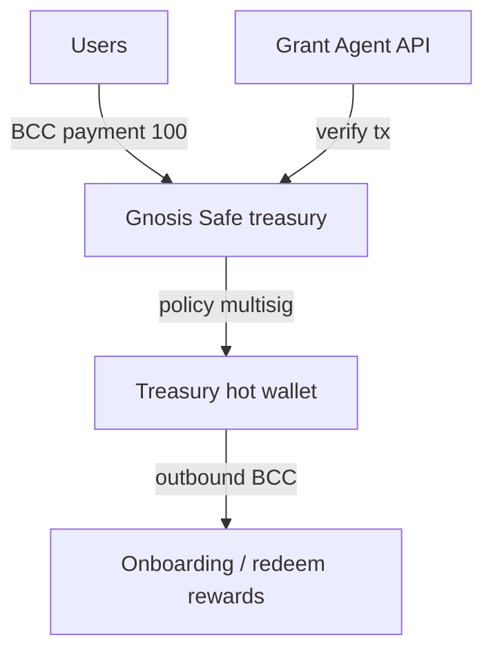

# Treasury & custody architecture

## Addresses

- Treasury Safe: `0x0D106D512Ac28cc29E625b22C6628989013c4C6B` (see `app/src/lib/treasury-revenue-rules.ts`)
- Revenue split (manual until `BccFeeRouter`): 40% treasury / 30% buyback / 20% builders / 10% burn

## Key env vars

- `BCC_TREASURY_ONCHAIN=1` — enable live outbound transfers
- `BCC_TREASURY_PRIVATE_KEY` — hot wallet (never commit)
- Bridge relayer: see `docs/BCC_BRIDGE_SECURITY.md`

## Agent economics

Agent share vault (30/30/30/10) documented on `/bcc/dashboard` — on-chain vault future work.
