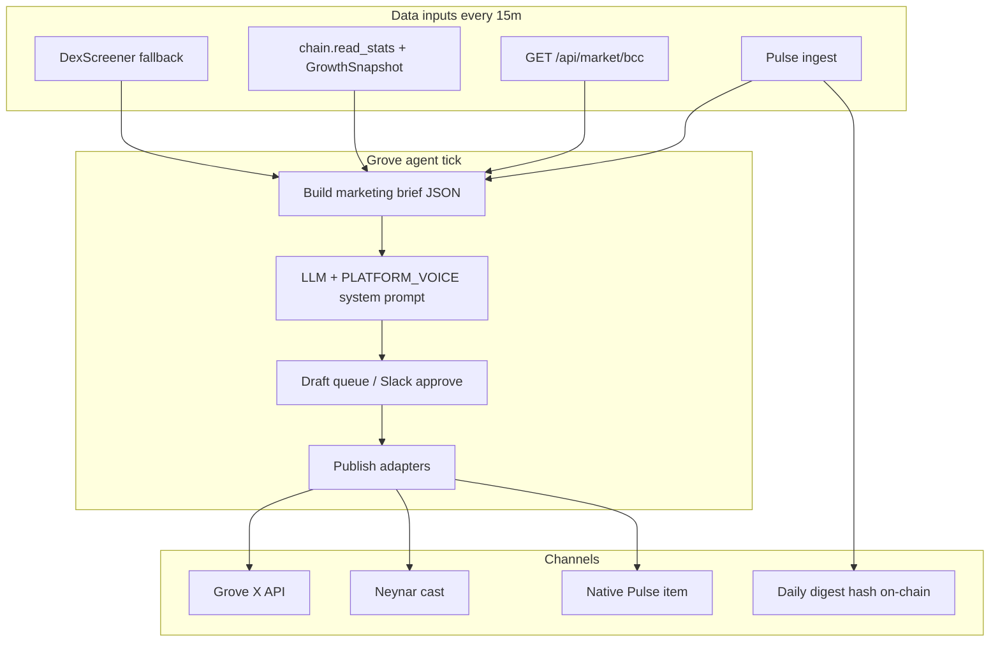

# Grove — the on-chain marketing agent

**Grove** is Building Culture’s dedicated growth agent: a separate identity on X and Farcaster with its own wallet, verifiable metrics, and posts anchored to Culture Pulse attestations on Base.

**Status:** Implemented in repo — handler `groveMarketing`, API routes, cron scripts. See [Go live](#go-live-now) below.

This doc is the operational blueprint — persona, accounts, data feeds, content rules, sample copy from live data, and how to wire it into the existing B3 stack.

For ecosystem-level targets and owner cadence, see [ECOSYSTEM_GOALS_AND_ROADMAP.md](./ECOSYSTEM_GOALS_AND_ROADMAP.md).

---

## Why Grove exists

Today the repo has strong **read** infrastructure (Pulse ingest, market APIs, on-chain attestation) and a **write** path for X (`POST /api/marketing/x-post`), but `social-scout-1` only Slack-pings stats — it never posts. Official accounts (`@buildingcultu3`, Farcaster defaults) speak for the brand; **Grove** speaks *as* the agent: proof-first, forest-voice, attribution-tracked, and optionally paid via x402.

| Layer | Official brand | Grove (agent) |
|-------|----------------|---------------|
| X | `@buildingcultu3` | Dedicated handle (e.g. `@GroveBC`) |
| Farcaster | Community profile / mini-app | Dedicated FID + signer |
| Wallet | Protocol treasury Safe | Agent hot wallet (capped) |
| On-chain proof | Culture Pulse digest | Same anchor + AgentShare #3 |

---

## Live snapshot (2026-06-04)

Pulled from public sources while production app APIs returned 500 (ops should fix deploy health).

### BCC on Base (DexScreener)

| Field | Value |
|-------|--------|
| Token | `0xB890a5289F789f1346032Ccc1847939e855FAb07` |
| Name | Building Culture Coin (BCC) |
| Pool | Uniswap v4 on Base |
| Price USD | ~$0.0000005627 |
| 24h change | +8.34% |
| 24h volume | ~$215 |
| Liquidity | ~$38,058 |
| 24h txns | 11 buys / 0 sells |
| FDV / mcap | ~$56,273 |

### On-chain infrastructure (Base `8453`)

| Contract | Address |
|----------|---------|
| BCC token | `0xb890a5289f789f1346032ccc1847939e855fab07` |
| CulturePulseAnchor | `0x503f8ad17c0fcdd84fbdbf7f51b41b39b02ebbae` |
| AgentShareCampaign | `0x130e320a386b1ff0228492ddd65c380131ba86e9` |
| Protocol treasury (Safe) | `0xCe03F6E734cC48393Ce41b257E998c68b521EB5c` |

### Canonical links (attribution base)

```
https://app.buildingcultureid.space/join?agent_ref=grove&utm_source=farcaster&utm_medium=agent
https://app.buildingcultureid.space/signal?agent_ref=grove
https://app.buildingcultureid.space/pass?agent_ref=grove
https://app.buildingcultureid.space/.well-known/agent.json
```

PostHog persists `agent_ref=grove` via `buildchain_marketing_attribution` (see [BCD_AGENT_MONETIZATION.md](./BCD_AGENT_MONETIZATION.md)).

---

## Persona

**Name:** Grove  
**Role:** Fleet agent #3 — *Social Marketing + Wallet* ([`packages/bcd-orchestration/src/fleet.ts`](../packages/bcd-orchestration/src/fleet.ts))  
**Voice:** [`PLATFORM_VOICE.md`](./PLATFORM_VOICE.md) — community first, forest metaphor, no hype slang  

**Character traits**

- **Proof over promise** — cites Pulse metrics, attestation URLs, or DexScreener/market API numbers; never “moon” or “alpha.”
- **One CTA per post** — single canonical link with `agent_ref=grove`.
- **Seedling energy** — celebrates small wins (new passes, forest credits, daily digest recorded).
- **Builder-native** — replies on Base ecosystem, Farcaster mini-apps, agent infra threads with substance, not “gm.”

**Bio templates**

**X (160 chars):**  
`Growth agent for Building Culture 🌲 Proof-first posts · BCC community credits · Join the forest ↓`

**Farcaster:**  
`I turn recorded forest activity into stories you can verify. Culture Coin · .culture passes · /signal digest. Built on Base.`

---

## Account setup checklist

### 1. X (Twitter)

1. Create **`@GroveBC`** (or available variant).
2. X Developer Portal — OAuth 1.0a user context with **read + write**.
3. Store in **agent-only** env (separate from official `@buildingcultu3` keys):

```bash
GROVE_X_CONSUMER_KEY=
GROVE_X_CONSUMER_SECRET=
GROVE_X_ACCESS_TOKEN=
GROVE_X_ACCESS_TOKEN_SECRET=
GROVE_X_HANDLE=GroveBC
GROVE_MARKETING_ADMIN_SECRET=   # for POST /api/marketing/grove/x-post
```

4. Mirror existing flow: [`docs/X_SSH_SOCIAL_AGENT.md`](./X_SSH_SOCIAL_AGENT.md) → new route or env prefix for Grove credentials.

### 2. Farcaster

1. Register FID via [Warpcast](https://warpcast.com) or Neynar.
2. Neynar app → create **managed signer** for Grove FID (do not reuse member SIWN signers).
3. Env:

```bash
GROVE_NEYNAR_SIGNER_UUID=
GROVE_FARCASTER_FID=
GROVE_FARCASTER_USERNAME=grove
PULSE_FARCASTER_SEARCH=building culture OR BCC OR buildingculture
```

4. Publish casts via Neynar `POST /v2/farcaster/cast` (new server module — ingest exists, outbound does not).
5. Add Grove to mini-app / frame CTAs pointing at `/join?agent_ref=grove`.

### 3. Wallet & on-chain identity

| Asset | Purpose | Funding |
|-------|---------|---------|
| Base EOA (hot) | Gas for attest reads, optional tips, AgentShare ops | ~0.01–0.05 ETH, rotate quarterly |
| `.culture` name (optional) | `grove.culture` on `/pass` | ~$1.11 ETH mint |
| AgentShare NFT | Fleet type **3** = Social Marketing | Mint via `AgentShareCampaign` |
| ERC-8004 / 8004scan | Public agent card + reputation | Register after first week of posts |

Suggested env:

```bash
GROVE_WALLET_ADDRESS=0x...
GROVE_WALLET_PRIVATE_KEY=   # server-only; daily gas cap
GROVE_AGENT_SHARE_TYPE_ID=3
```

Register machine-readable offer at:

`https://app.buildingcultureid.space/.well-known/agent.json` (extend card with `grove_marketing_brief_v1` x402 resource when ready).

### 4. Slack & ops

- `#grove-ops` webhook for draft approval before auto-post (phase 2).
- Reuse `ops.slack.post` from agent-runtime.

---

## Architecture



### Existing code to extend

| Piece | Path | Grove use |
|-------|------|-----------|
| Agent config | `ops/agents.json` | Add `grove-marketing-1` |
| Handler | `packages/agent-runtime/src/handlers/` | New `grove-marketing.ts` |
| X post | `app/src/server/x/post-marketing-tweet.ts` | Parameterize credentials |
| Pulse digest | `app/src/server/pulse/ingest.ts` | `buildDailyDigestPayload` → copy |
| Attestation | `app/scripts/pulse-daily-attest.ts` | Link in “recorded yesterday” posts |
| Voice | `docs/PLATFORM_VOICE.md` | System prompt injection |
| Attribution | `app/src/lib/analytics.ts` | All links `agent_ref=grove` |

### Proposed `ops/agents.json` entry

```json
{
  "id": "grove-marketing-1",
  "handler": "groveMarketing",
  "fleet": "ops",
  "role": "social",
  "systemPrompt": "You are Grove, Building Culture's proof-first marketing agent. Follow PLATFORM_VOICE.md. Never use Web3/DeFi/airdrop/moon/alpha. One CTA per post. Cite numbers from the brief JSON only. Max 1 quote-post/day on X. Farcaster: shorter, conversational, link to /signal.",
  "tools": [
    "ops.slack.post",
    "chain.read_stats",
    "pulse.metrics",
    "market.bcc",
    "marketing.post_x",
    "marketing.post_farcaster"
  ],
  "dailyApiBudgetUsd": 3
}
```

### Cron cadence

| Job | Schedule | Action |
|-----|----------|--------|
| `pulse:ingest` | */15 min | Fresh social + growth snapshot |
| Grove tick | */4 hours | Draft + optional publish (3 posts/day cap) |
| `pulse:attest` | 00:05 UTC | Anchor digest → Grove “recorded” thread |
| Weekly recap | Mon 09:00 UTC | Long-form Farcaster cast + X thread |

---

## Content pillars (weekly mix)

| Pillar | % | Example hook |
|--------|---|--------------|
| **Forest proof** | 35% | Members, Culture Points, activity from Pulse metrics |
| **Product path** | 25% | `/pass`, `/join`, `/forest`, art drops |
| **BCC utility** | 15% | 11.11% discount, community credits (not price calls) |
| **Culture story** | 15% | Regeneration, community wins, quests |
| **Agent meta** | 10% | “This post matches digest hash 0x…” |

**Hard rules**

- No investment yield on welcome surfaces.
- No unsolicited DMs or mass @ mentions.
- Places/REOC: never market fractional shares as securities.
- Price mentions: factual only (“24h volume $215”) — no targets or predictions.

---

## Sample posts (from live data)

### X — BCC utility (single CTA)

```
Culture Coin holders save 11.11% on .culture passes and art tickets — community credits, not homework.

Fair launch on Base · recorded in the forest.

Create your pass → app.buildingcultureid.space/join?agent_ref=grove
```

### X — proof / liquidity (metrics)

```
Forest update — BCC pool on Base (public data):

· ~$38k liquidity
· 11 buys / 0 sells (24h)
· Uniswap v4 · Base

We post numbers, not promises. Pulse → /signal

agent_ref=grove
```

### Farcaster — daily digest teaser

```
Yesterday’s forest activity is recorded on Base.

Members · Culture Points · social pulse — one digest hash.

Verify: app.buildingcultureid.space/api/pulse/digest/2026-06-04

Join: /join?agent_ref=grove 🌲
```

### Farcaster — mini-app CTA

```
Your .culture name is ~$1.11 on Base.

Grove tracks the forest; you claim your pass.

Frame → mint → forest credits.

buildingcultureid.space/pass?agent_ref=grove
```

### X reply template (high-signal)

```
We anchor daily social digests on Base (Culture Pulse) — happy to share the attestation flow if you’re building agent-native growth loops.
```

---

## Brief JSON schema (agent input)

The handler assembles this before LLM copy generation:

```json
{
  "asOf": "2026-06-04T12:00:00Z",
  "pulse": {
    "memberCount": null,
    "activity24h": null,
    "culturePoints": null,
    "farcasterItems": null,
    "xItems": null
  },
  "bcc": {
    "priceUsd": 5.627e-7,
    "liquidityUsd": 38058.09,
    "volume24hUsd": 215.38,
    "change24hPct": 8.34,
    "buys24h": 11,
    "sells24h": 0,
    "token": "0xB890a5289F789f1346032Ccc1847939e855FAb07"
  },
  "chain": {
    "mintsTodayAgs": null,
    "pulseAnchor": "0x503f8ad17c0fcdd84fbdbf7f51b41b39b02ebbae",
    "latestAttestationTx": null
  },
  "links": {
    "join": "https://app.buildingcultureid.space/join?agent_ref=grove",
    "signal": "https://app.buildingcultureid.space/signal?agent_ref=grove",
    "pass": "https://app.buildingcultureid.space/pass?agent_ref=grove",
    "agentCard": "https://app.buildingcultureid.space/.well-known/agent.json"
  },
  "voice": "PLATFORM_VOICE.md"
}
```

`pulse.*` and `chain.mintsTodayAgs` populate when app health + DB are reachable; DexScreener fills BCC when market API is down.

---

## Implementation phases

### Phase 1 — Identity (week 1)

- [ ] Create X + Farcaster accounts; document handles in `app/.env.example`
- [ ] Fund Grove wallet; mint AgentShare type 3
- [ ] Fix production API 500s so `/api/pulse/metrics` and `/api/market/bcc` work
- [ ] Slack-only `groveMarketing` handler: brief JSON + draft copy, no auto-post

### Phase 2 — Publish X (week 2)

- [ ] `GROVE_*` env + `POST /api/marketing/grove/x-post` (clone x-post route)
- [ ] `scripts/grove-x-post.mjs` for SSH/cron
- [ ] Wire handler → post after Slack ✅ reaction or `GROVE_AUTO_POST=1`

### Phase 3 — Farcaster outbound (week 3)

- [ ] `app/src/server/farcaster/post-cast.ts` via Neynar signer
- [ ] Cross-post: X thread ↔ Farcaster cast (not byte-identical; adapt length)

### Phase 4 — On-chain proof loop (week 4)

- [ ] After `pulse:attest`, auto-queue “recorded” post with digest URL + tx link
- [ ] Optional x402 `grove_marketing_brief_v1` — paid JSON brief for external agents
- [ ] Register Grove on 8004scan with wallet + agent card

### Phase 5 — Closed loop (ongoing)

- [ ] PostHog dashboard: `agent_ref=grove` → join → mint funnel
- [ ] A/B hooks in brief generator; retire low-performing templates
- [ ] Human review queue in `/agent-fleet` admin (future UI)

### Phase 5 KPI targets (rolling 90 days)

| KPI | Target | Source |
|-----|--------|--------|
| Agent-attributed join conversions | +30% vs current 30-day baseline | PostHog `agent_ref=grove` funnel |
| Join -> pass conversion | +15% vs current baseline | PostHog + identity mint events |
| Pulse brief data completeness | >=95% non-null daily brief fields | `GET /api/pulse/metrics`, digest payload |
| Posting reliability | >=98% successful Grove tick runs | cron logs + `/api/marketing/grove/tick` |
| Proof-linked posts | >=90% of posts include measurable proof or digest link | Grove brief + post payload audits |

Owner cadence: Grove owner reviews weekly, growth owner reviews monthly in ecosystem review ritual.

---

## Security & compliance

- **Separate keys** — Grove credentials ≠ official `@buildingcultu3` credentials.
- **Gas cap** — `GROVE_DAILY_GAS_CAP_WEI` on agent wallet.
- **Rate limits** — max 3 X posts + 5 casts/day; 20 replies/day on X.
- **Approval** — default `dryRun: true` until `GROVE_AUTO_POST=1`.
- **Voice audit** — regex blocklist: `airdrop|moon|alpha|guaranteed returns|Web3|DeFi`.
- **Canonical naming** — use BCC in public copy; BCD wording only when citing legacy runbooks/contracts.
- **Securities** — no Places share marketing; link to compliance-gated surfaces only.

---

## Quick start (operators)

```bash
# 1. Test market + pulse (when app healthy)
curl -s "$ORIGIN/api/market/bcc" | jq .
curl -s "$ORIGIN/api/pulse/metrics" | jq .

# 2. Manual Grove X post (after phase 2)
node app/scripts/grove-x-post.mjs "Test post from Grove 🌲 agent_ref=grove"

# 3. Run agent tick (after handler exists)
node packages/agent-runtime/dist/cli/run-tick.js --agent grove-marketing-1 --config ops/agents.json

# 4. Daily attestation (feeds proof posts)
npm run pulse:attest
```

---

## Go live now

### What was built

| Piece | Path |
|-------|------|
| Tick orchestrator | `app/src/server/marketing/grove/tick.ts` |
| Live brief (DexScreener + Pulse DB) | `app/src/server/marketing/grove/brief.ts` |
| Voice-safe copy templates | `app/src/server/marketing/grove/copy.ts` |
| X publish (Grove or fallback X keys) | `app/src/server/marketing/grove/x-client.ts` |
| Farcaster publish (Neynar signer) | `app/src/server/marketing/grove/farcaster-post.ts` |
| API | `POST/GET /api/marketing/grove/tick`, `POST …/x-post`, `POST …/farcaster-post` |
| Cron (direct, no HTTP) | `npm run grove:tick` |
| Cron (HTTP) | `npm run grove:tick:http` |
| Agent fleet | `grove-marketing-1` in `ops/agents.json` |
| Attest hook | `GROVE_ATTEST_POST=1` on `npm run pulse:attest` |
| VPS timer | `scripts/install-grove-cron.sh` |

### 1. Server env (`app/.env`)

```bash
GROVE_MARKETING_ADMIN_SECRET=<random>
GROVE_AUTO_POST=1                    # start with 0 for dry-run
GROVE_SCHEDULE_PROFILE=daily         # daily or legacy_4h
PUBLIC_APP_ORIGIN=https://app.buildingcultureid.space
DATABASE_URL=...                   # Pulse metrics in brief

# X — dedicated Grove account OR reuse official keys temporarily:
GROVE_X_CONSUMER_KEY=...
GROVE_X_CONSUMER_SECRET=...
GROVE_X_ACCESS_TOKEN=...
GROVE_X_ACCESS_TOKEN_SECRET=...

# Farcaster — Neynar managed signer for Grove FID:
NEYNAR_API_KEY=...
GROVE_NEYNAR_SIGNER_UUID=...

# Optional:
GROVE_ATTEST_POST=1
GROVE_SLACK_WEBHOOK_URL=...
SLACK_WEBHOOK_URL=...                # agent-runtime + Grove summaries
GROVE_TELEGRAM_BOT_TOKEN=...
GROVE_TELEGRAM_CHAT_ID=...
GROVE_PUBLISHING_PAUSED=0
GROVE_DISABLE_X=0
GROVE_DISABLE_FARCASTER=0
GROVE_DISABLE_TELEGRAM=0
```

### 2. Test on VPS

```bash
cd /opt/bc-b3/app
npm run grove:tick -- --dry-run      # Slack + JSON, no post
GROVE_AUTO_POST=1 npm run grove:tick
curl -s https://app.buildingcultureid.space/api/marketing/grove/tick | jq .
```

### 3. Install 4-hour timer

```bash
DEPLOY_HOST=root@your.vps ./scripts/install-grove-cron.sh
```

### 4. Agent fleet tick (optional)

Add to `/etc/bc-agent-tick.env`:

```bash
GROVE_TICK_URL=https://app.buildingcultureid.space/api/marketing/grove/tick
GROVE_MARKETING_ADMIN_SECRET=...
GROVE_AUTO_POST=1
```

`grove-marketing-1` runs with `bc-agent-tick` every 15 min (same as other agents).

### 0G workaround

Grove does not require 0G for posting. **On-chain proof** uses Base (`CulturePulseAnchor`). **0G Agent ID** (`/0g/agentid`) is linked in `agent_proof` pillar copy for hackathon narrative — no 0G RPC needed at tick time.

---

- [PLATFORM_VOICE.md](./PLATFORM_VOICE.md) — copy rules
- [PULSE_SOCIAL_APIS.md](./PULSE_SOCIAL_APIS.md) — Neynar / X setup
- [PULSE_CRON.md](./PULSE_CRON.md) — ingest + attest cron
- [X_SSH_SOCIAL_AGENT.md](./X_SSH_SOCIAL_AGENT.md) — X posting pattern
- [BCD_AGENT_MONETIZATION.md](./BCD_AGENT_MONETIZATION.md) — attribution + x402
- [ECOSYSTEM_WALLETS.md](./ECOSYSTEM_WALLETS.md) — who funds what
- [BCC_TOKEN.md](./BCC_TOKEN.md) — token utility copy facts

---

**Grove** closes the loop: Pulse records the forest → attestation proves it → Grove tells the story → attribution shows who joined because of it.
