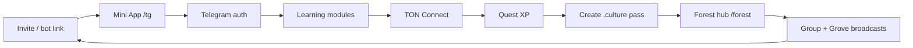

# Telegram Mini App — go-live follow-up

**Ecosystem checklist:** [ECOSYSTEM_GO_LIVE_RUNBOOK.md](./ECOSYSTEM_GO_LIVE_RUNBOOK.md) (Phase 2).

**Goal:** Simple **Community Arcade** mini app — daily tap-in, fun missions, leaderboard. Moderators explain the bigger picture in-channel; the app gets people in and playing.

**UX:** 3 tabs — **Home** (streak + one mission), **Play** (micro-tasks), **Rank** (TG leaderboard). TON wallet is an **optional bonus** after 3 core missions.

**Canonical surfaces**

| What | URL |
|------|-----|
| Mini App (in Telegram) | https://app.buildingcultureid.space/tg |
| Bot (menu opens Mini App) | https://t.me/buildingcultureappbot |
| Community group (invite) | https://t.me/+4zFH7-2tyW0yOTBk |
| Full ecosystem app | https://app.buildingcultureid.space |

---

## Current status (as of deploy)

### Working today

| Check | Status | Notes |
|-------|--------|-------|
| Mini App page `/tg` | ✅ 200 | 3-tab arcade: Home / Play / Rank; daily check-in + streak |
| Bot token on production | ✅ | `@buildingcultureappbot` — `getMe` OK |
| Menu button → Web App | ✅ | “Open Building Culture” → `/tg` |
| Telegram auth API | ✅ | Validates `Authorization: tma <init_data>` when opened inside Telegram |
| Member + wallet sync | ✅ | Synthetic wallet for Culture Points (quests no longer fail on `wallet_not_linked`) |
| TON Connect manifest | ✅ | `/tonconnect-manifest.json` |
| TG leaderboard | ✅ | `GET /api/tg/leaderboard` — top growers by XP |
| Daily streak | ✅ | `tg:daily_checkin` events + bonus XP at 3/7/14 days |
| Dev console | ✅ | `/tg/dev` for local API testing |
| API contract | ✅ | All `/api/tg/*` routes implemented — see [TELEGRAM_MINIAPP_API_CONTRACT.md](./TELEGRAM_MINIAPP_API_CONTRACT.md) |

### Not working / not done yet

| Gap | Impact | Priority |
|-----|--------|----------|
| **Real in-Telegram QA not signed off** | Unknown UX bugs on iOS/Android Telegram clients | **P0** — you must open the bot and tap through once |
| **Grove → Telegram channel posts** | Automated broadcasts to BuildingCulture group | ✅ `GROVE_TELEGRAM_CHAT_ID` + bot token on prod |
| **XRP quotes use fallback math** | Not live XRPL orderbook yet | P2 — wire `XRPL_RPC_URL` when ready |
| **Forest stage auto-progression** | Updates on task complete | ✅ seedling → sapling → tree by level |
| **Pulse ingest cron** | No persisted `GrowthSnapshot` history | P2 — install `bc-pulse-ingest.timer` on VPS |
| **Production smoke for `/api/tg/*`** | CI doesn’t gate Telegram endpoints | ✅ `npm run growth:audit` / `production-smoke.sh` |
| **Bot welcome copy / `/start` deep link** | Cold opens don’t explain the loop | P1 — BotFather description + optional start message |
| **`start_param` attribution in analytics** | Hard to measure which invite drove joins | P1 — verify PostHog `tg_*` events + UTM |
| **Duplicate tokens in local `app/.env`** | Local dev may hit wrong bot | P1 — keep one token; sync from `deploy/.env` |

### Expected errors (not bugs)

| Symptom | Cause |
|---------|--------|
| `missing_init_data` when curling `/api/tg/auth` | Normal — real auth only works inside Telegram WebApp |
| `telegram_not_configured` | Server missing `TELEGRAM_BOT_TOKEN` — **fixed on prod** |
| Quest “Connect TON first” | User must connect wallet before claiming wallet quest |
| XRP “execution disabled” | By design until treasury approval (`XRPL_EXECUTION_ENABLED=0`) |

---

## Your checklist — get the Mini App live on Telegram

### Step 1 — Open and verify (5 min) **do this first**

1. Open **https://t.me/buildingcultureappbot** on your phone.
2. Tap **Open Building Culture** (menu button, bottom-left in chat).
3. Confirm the app loads (not a blank screen or 404).
4. Walk through (under 60 seconds):
   - [ ] Lands on **Home** — “One person. One block.” + your name
   - [ ] Tap **Daily tap-in** → +XP toast
   - [ ] **Play** tab → wave, mood, quick quiz
   - [ ] **Rank** tab → see your position on the board
   - [ ] After 3 missions, optional **Wallet bonus** on Home (TON)
   - [ ] Footer “Explore the full app” opens `/join` (optional)

If anything fails, note the error text on screen and check server logs:

```bash
ssh root@187.124.18.204 'docker logs buildingculture-web-1 --tail 50'
```

### Step 2 — BotFather polish (10 min)

In [@BotFather](https://t.me/BotFather) for `@buildingcultureappbot`:

| Setting | Suggested value |
|---------|-----------------|
| Description | Building Culture — learn, connect TON, earn XP, grow the community forest. |
| About | Mini App for quests, learning, and your .culture pass on Base. |
| Menu button | Already set → `https://app.buildingcultureid.space/tg` |
| Profile photo | Brand icon (optional) |

Re-run menu setup anytime:

```bash
cd b3
TELEGRAM_BOT_TOKEN='<from deploy/.env>' npm run tg:setup
```

### Step 3 — Wire the community group (15 min)

The **bot** and the **group** are separate surfaces:

1. **Pin** a message in https://t.me/+4zFH7-2tyW0yOTBk with:
   - Link to bot: `https://t.me/buildingcultureappbot`
   - One-line CTA: “Tap Open Building Culture → complete quests → invite friends”
2. Optional: add the bot as **group admin** (post-only) if you want Grove to broadcast there later.
3. For Grove automated posts, add to `deploy/.env`:

```bash
GROVE_TELEGRAM_BOT_TOKEN=<bot or dedicated poster bot>
GROVE_TELEGRAM_CHAT_ID=<group chat id>
```

Then redeploy env + restart web container.

### Step 4 — Attribution links for growth (ongoing)

Share links that carry referral context:

```text
https://t.me/buildingcultureappbot?start=ref_grove
https://t.me/buildingcultureappbot?start=ref_community
```

Inside `/tg`, `start_param` flows into the “Create your .culture pass” link as `agent_ref`.

### Step 5 — Redeploy after env changes

Whenever you change `deploy/.env` (token, XRPL, Grove Telegram):

```bash
cd b3
./scripts/sync-deploy-env.sh
rsync -avz -e "ssh -i ~/.ssh/id_ed25519_wgsdex" deploy/.env \
  root@187.124.18.204:/opt/buildingculture-frontend/app/.env
ssh -i ~/.ssh/id_ed25519_wgsdex root@187.124.18.204 \
  'cd /opt/buildingculture-frontend && APP_PORT=3011 docker compose -f app/docker-compose.stack.yml --env-file app/.env up -d --force-recreate web'
```

For code changes (UI, API), use full deploy:

```bash
cd b3 && ./scripts/deploy-grove.sh
```

---

## Growth loop (what “bloom” looks like)



**Daily ops (once live)**

1. Open bot → confirm Mini App loads.
2. Check quest completions in DB or `/agent-fleet` ledger.
3. Review `/api/pulse/metrics` for member/activity counts.
4. One improvement or broadcast per day (Grove tick, pinned group message, or quest tweak).

**KPIs to watch**

- Telegram WAU (unique `tg:auth_success` per week)
- TON connect rate (auth → `tg:ton_wallet_connected`)
- Quest claim rate
- Learning module completions
- Pass funnel: Mini App → `/join` with `utm_source=telegram`

---

## Local dev (when building features)

```bash
cd b3
npm run dev:local          # or npm run dev from app/
# UI:  http://localhost:5173/tg
# API: http://localhost:5173/tg/dev
```

Ensure `app/.env` has **one** `TELEGRAM_BOT_TOKEN` (match `deploy/.env`). Use `VITE_TELEGRAM_DEV_USER_ID` for browser bypass.

---

## Next engineering slices (after first live users)

| Slice | Outcome |
|-------|---------|
| PostHog dashboard for `tg_*` events | Funnel visibility |
| Streak + forest stage rules | Retention + narrative |
| Real XRPL orderbook quotes | Credible learn-mode trading education |
| Grove Telegram auto-posts | Compounding community reach |
| `production-smoke.sh` Telegram gate | Deploy confidence |
| `/tg/market` and `/tg/pass` routes | Cleaner deep links from BotFather |

---

## Related docs

- [TELEGRAM_MINIAPP_SETUP.md](./TELEGRAM_MINIAPP_SETUP.md) — install script + local testing
- [TELEGRAM_MINIAPP_TON_XRP.md](./TELEGRAM_MINIAPP_TON_XRP.md) — architecture + phased XRP
- [TELEGRAM_MINIAPP_API_CONTRACT.md](./TELEGRAM_MINIAPP_API_CONTRACT.md) — endpoint spec
- [RELEASE_CAPTAIN_15MIN.md](./RELEASE_CAPTAIN_15MIN.md) — Telegram smoke commands for release windows

---

## Quick reference — smoke

```bash
BASE=https://app.buildingcultureid.space

curl -sS -o /dev/null -w "/tg %{http_code}\n" "$BASE/tg"
curl -sS "$BASE/api/market/xrp-quote?base=XRP&quote=USD&amount=10&mode=learn" | jq .
curl -sS "$BASE/tonconnect-manifest.json" | jq .

# Real auth (paste initData from Telegram WebApp dev tools or logged header):
# curl -sS -X POST "$BASE/api/tg/auth" \
#   -H "authorization: tma $TG_INIT_DATA" \
#   -H "content-type: application/json" -d '{}' | jq .
```

**Bottom line:** The Mini App is **built and wired on production**. The bot menu opens it. Your immediate job is **Step 1 — open `@buildingcultureappbot` on your phone and confirm the loop works**, then **pin the bot in the community group** and start sharing attributed invite links.
