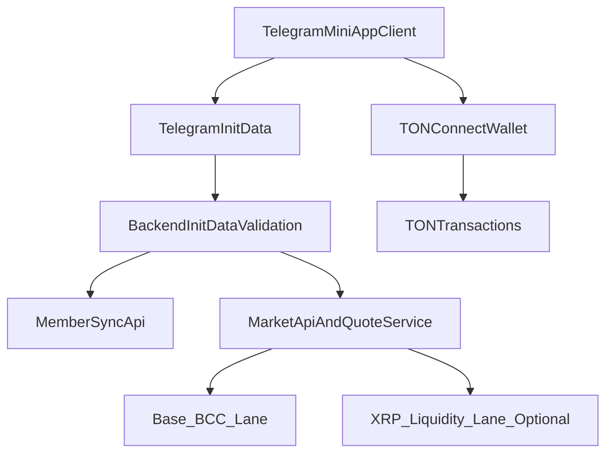

# Telegram Mini App + TON + XRP liquidity (readiness blueprint)

This is the fastest safe path to launch a Telegram Mini App that compounds growth without fragmenting your current ecosystem.

## Strategic intent

- Reuse Building Culture growth loops inside Telegram.
- Add TON-native wallet/payment support for Telegram users.
- Introduce XRP liquidity as an optional second lane without breaking Base/BCC core.
- Reward pro-social behavior through gratitude actions (`support`, `educate`, `create`) that compound retention.

Canonical ecosystem front door remains: `https://app.buildingcultureid.space`.

## Core architecture (MVP first)

## What to implement first (order matters)

1. Telegram Mini App shell + backend init-data validation.
2. TON Connect wallet integration and one successful TON transaction flow.
3. Telegram attribution + conversion analytics.
4. XRP liquidity path as quote-only first, then executable path.

## Telegram auth and security (required)

Per Telegram Mini Apps docs (`tma.js`), do **server-side** validation of init data:

- Validate `Authorization: tma <init_data>` using bot token.
- Enforce expiration window (recommended 1 hour).
- Parse user payload only after signature validation.
- Reject invalid/missing init data with explicit 401.

Recommended package:

- `@tma.js/init-data-node` (`validate`, `parse`, `isValid`)

## TON wallet and transaction lane

Per TON Connect SDK:

- Use TON Connect UI for wallet connect in the miniapp.
- Keep one simple send transaction example for first success proof.
- Store `validUntil` and signed transaction result for tracing.

Recommended packages:

- `@tonconnect/ui-react` for UI
- `@tonconnect/sdk` for lower-level control where needed

## XRP liquidity strategy (safe rollout)

Important: XRP is not native to TON by default. Do this in phases:

### Phase A (now): XRP quote lane (no direct settlement risk)

- Add XRP market quote endpoints in backend (read-only pricing + depth).
- Use `xrpl.js` orderbook/balance APIs for visibility.
- Show quote/route options in Telegram UI, but execute only on already-safe rails.

### Phase B (next): controlled execution lane

- Enable XRP execution only with explicit treasury and risk guardrails.
- Enforce per-tx caps and daily volume caps.
- Add reconciliation logs and incident rollback playbook.

### Phase C (later): bridge or wrapped XRP path on TON

- Only after reliability + legal + treasury controls are proven.

## Product surfaces for Telegram MVP

- `/tg/join` — Telegram-first onboarding
- `/tg/wallet` — TON connect + status
- `/tg/market` — BCC + XRP quote cards
- `/tg/pass` — route to identity flow with Telegram attribution

## Environment checklist

### Telegram

- `TELEGRAM_BOT_TOKEN`
- `TELEGRAM_MINIAPP_URL`
- `TELEGRAM_INITDATA_MAX_AGE_SEC=3600`

### TON

- `VITE_TONCONNECT_MANIFEST_URL`
- `VITE_TON_NETWORK` (mainnet/testnet as needed)

### XRP quote lane

- `XRPL_RPC_URL` (or websocket endpoint)
- `XRPL_QUOTE_ENABLED=1`
- `XRPL_EXECUTION_ENABLED=0` (start disabled)

### Existing ecosystem

- Keep current Base/BCC env untouched.
- Keep canonical attribution keys (`agent_ref`, UTMs) flowing.

## KPI alignment

Track these in the same ecosystem scoreboard:

- Telegram WAU
- Telegram join -> wallet connect conversion
- Telegram wallet connect -> paid action conversion
- Gratitude actions per WAU (support/educate/create mix)
- TON tx success rate
- XRP quote requests (and later execution success rate)

## 7-day launch checklist

### Day 1-2: Foundations

- Telegram miniapp shell + secure init-data validation.
- Basic telemetry and error logging.

### Day 3-4: Wallet and actions

- TON connect and one stable transaction route.
- Telegram-specific onboarding route live.

### Day 5: XRP quote visibility

- XRP quote endpoint in market API (read-only).
- UI cards for XRP route options with clear risk labels.

### Day 6: Reliability and abuse protections

- Rate limits, auth checks, endpoint alerts.
- Incident response notes for Telegram lane.

### Day 7: Controlled go-live

- Limited audience release.
- Daily KPI review and bug triage.

## Safety rails (must keep)

- No direct XRP execution in Telegram until quote lane is stable.
- No broad paid campaign before endpoint reliability is green.
- No treasury policy bypass for new liquidity rails.

## Related docs

- [FARCASTER_MINIAPP.md](./FARCASTER_MINIAPP.md)
- [WORLD_MINI_APP.md](./WORLD_MINI_APP.md)
- [TELEGRAM_MINIAPP_API_CONTRACT.md](./TELEGRAM_MINIAPP_API_CONTRACT.md)
- [TELEGRAM_MINIAPP_API_CONTRACT.md](./TELEGRAM_MINIAPP_API_CONTRACT.md)
- [MARKET_API.md](./MARKET_API.md)
- [ECOSYSTEM_WALLETS.md](./ECOSYSTEM_WALLETS.md)
- [TREASURY_POLICY.md](./TREASURY_POLICY.md)
