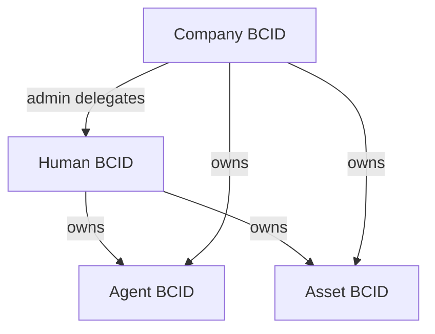

# BCID Identity Architecture

Four BCID types with namespace, issuance, and metadata standards.

---

## Type hierarchy

---

## 1. Human BCID

**DID format:** `did:bcid:human:{uuid}`  
**Onchain:** Soulbound ERC-721 token in `BcidRegistry`  
**Mint:** Month 2 testnet, Month 3 mainnet (first 100)

### Required fields
| Field | Storage | Public |
|-------|---------|--------|
| `did` | Onchain tokenURI hash | Yes |
| `ownerAddress` | Onchain owner | Yes |
| `publicHandle` | Postgres + IPFS | Yes |
| `displayName` | Postgres + IPFS | Yes |
| `createdAt` | Onchain mint timestamp | Yes |
| `recoveryGuardians` | Onchain RecoveryModule | Hashed |
| `encryptedProfileRef` | IPFS/4EVERLAND | No (encrypted) |

### Issuance requirements
- SIWE-authenticated wallet
- Unique public handle (3–32 chars, `[a-z0-9-]`)
- Mint fee paid (ETH or BCC)
- Optional: link `.culture` via bridge

---

## 2. Company BCID

**DID format:** `did:bcid:company:{uuid}`  
**Launch:** Month 4

### Required fields
| Field | Storage |
|-------|---------|
| `legalName` | Encrypted |
| `jurisdiction` | Public metadata |
| `adminBcidDids` | Postgres (Human BCIDs) |
| `kybDocumentHash` | Encrypted storage |
| `publicHandle` | Public |

### Issuance
- BC admin approval + primary admin Human BCID
- KYB document hash stored encrypted
- Delegated admins can issue Company-scoped credentials

---

## 3. Asset BCID

**DID format:** `did:bcid:asset:{uuid}`  
**Launch:** Month 5 (metadata standards Month 1)

### Asset categories
| Category | Metadata standard |
|----------|-------------------|
| House | [ASSET_METADATA_STANDARDS.md](../protocol/ASSET_METADATA_STANDARDS.md#house) |
| Car | #car |
| Watch | #watch |
| Business | #business |
| Certificate | #certificate |

### Issuance
- Owner Human or Company BCID
- Ownership proof (title hash, oracle attestation, or existing NFT link)
- Soulbound Asset BCID bound to owner until transfer ceremony

---

## 4. Agent BCID

**DID format:** `did:bcid:agent:{uuid}`  
**Launch:** Month 4

### Required fields
| Field | Purpose |
|-------|---------|
| `ownerBcidDid` | Human or Company BCID |
| `agentWalletAddress` | Dedicated agent wallet |
| `agentCardUrl` | `/.well-known/agent.json` |
| `erc8004Id` | Optional registry ID |
| `spendCapWei` | Max per-transaction |
| `policyHash` | IPFS policy document |

### Issuance
- Owner BCID signs delegation
- Agent wallet generated or imported
- ERC-8004 registration recommended
- Trusted Agent credential auto-eligible

Detail: [AGENT_ECONOMY.md](../protocol/AGENT_ECONOMY.md).

---

## Namespace resolution

| Query | Resolver |
|-------|----------|
| `did:bcid:human:*` | `GET /api/bcid/resolve?did=` |
| Public handle | `GET /api/bcid/resolve?handle=` |
| Onchain token ID | `BcidRegistry.ownerOf(tokenId)` |

---

## Postgres models

See [DATABASE_SCHEMA.md](./DATABASE_SCHEMA.md) for `BcidIdentity`, `BcidLinkedAccount`, `BcidBridgeLink`.

---

## Month 1–2 scope cut

**In scope Month 2:** Human BCID only  
**Deferred:** Company, Asset, Agent BCID mint contracts (spec only until Month 4–5)
