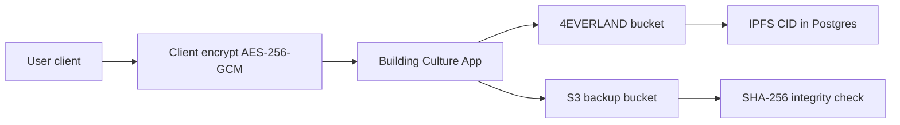

# BCID Storage Architecture

Encrypted credential and certificate storage. **Month 1 recommendation; Month 5 implementation.**

---

## Requirements

| Requirement | Priority |
|-------------|----------|
| Encrypted at rest (user-key or envelope encryption) | P0 |
| Content-addressed integrity (hash verification) | P0 |
| Cost predictable at 10k users / 100k credentials | P0 |
| GDPR-compatible deletion | P1 |
| Pinning durability ≥ 5 years for certificates | P1 |
| S3-compatible API for app integration | P2 |

---

## Candidate comparison

| Provider | Cost (est. 10GB encrypted) | Durability | Encryption | BC fit |
|----------|---------------------------|------------|------------|--------|
| **4EVERLAND** | ~$2–5/mo (bucket) | IPFS pinning + CDN | Client-side required | **Recommended primary** — already used for landing assets |
| **Filecoin** | ~$0.15/GB/mo storage | High (deals) | Client-side | Good for long-term archive tier |
| **Arweave** | ~$5–8 one-time/GB | Permanent | Client-side | Best for immutable certificates |
| **IPFS (self-hosted)** | Infra cost only | Depends on pinning | Client-side | Dev/test only |
| **S3 backup** | ~$0.23/GB/mo | 99.999999999% | SSE-KMS + client | **Recommended backup** — ops familiarity |

---

## Recommended architecture (Month 5)



### Tier strategy

| Data type | Primary | Backup | Retention |
|-----------|---------|--------|-----------|
| PII profile blob | 4EVERLAND | S3 | Until deletion request |
| KYC documents | 4EVERLAND encrypted | S3 Glacier | 7 years (jurisdiction-dependent) |
| Certificates | Arweave (immutable) | S3 | Permanent |
| Credential evidence JSON | 4EVERLAND | — | Life of credential |

---

## Security analysis

| Threat | 4EVERLAND | Filecoin | Arweave | S3 |
|--------|-----------|----------|---------|-----|
| Provider compromise | Mitigated by client encryption | Same | Same | SSE + client encryption |
| Pin loss | Re-pin from backup CID | Deal renewal | Permanent | N/A |
| Unauthorized read | Encryption key only on client | Same | Same | IAM + encryption |
| Cost spike | Bucket limits + alerts | Deal monitoring | Upfront only | Lifecycle policies |

---

## Encryption model

```
encryptedBlob = AES-256-GCM(plaintext, userDerivedKey)
userDerivedKey = HKDF(walletSignature, "bcid-storage-v1")
storageRef = { cid, provider, iv, authTag, schemaVersion }
```

- App never stores raw encryption keys
- Recovery: re-derive key from wallet signature post-recovery
- Selective disclosure: ZK layer proves hash commitment without revealing blob

---

## Postgres storage refs

```prisma
model BcidEncryptedBlob {
  id              String   @id @default(cuid())
  bcidIdentityId  String
  purpose         String   // profile | kyc | certificate | evidence
  storageProvider String   // 4everland | arweave | s3
  cid             String
  contentHash     String   // sha256 of ciphertext
  schemaVersion   String   @default("1")
  createdAt       DateTime @default(now())
}
```

---

## Cost projection (100 BCIDs → 10k BCIDs)

| Scale | 4EVERLAND | S3 backup | Arweave (certs only) | Monthly total |
|-------|-----------|-----------|---------------------|---------------|
| 100 users | $2 | $1 | $20 one-time | ~$3/mo |
| 1k users | $5 | $5 | $100 one-time | ~$10/mo |
| 10k users | $25 | $30 | $500 one-time | ~$55/mo |

---

## Month 1 deliverable status

- [x] Cost analysis
- [x] Security analysis
- [x] Architecture recommendation (4EVERLAND primary + S3 backup + Arweave for immutable certs)
- [ ] Provider API keys provisioned (Month 5)
- [ ] Client encryption library (Month 5)
