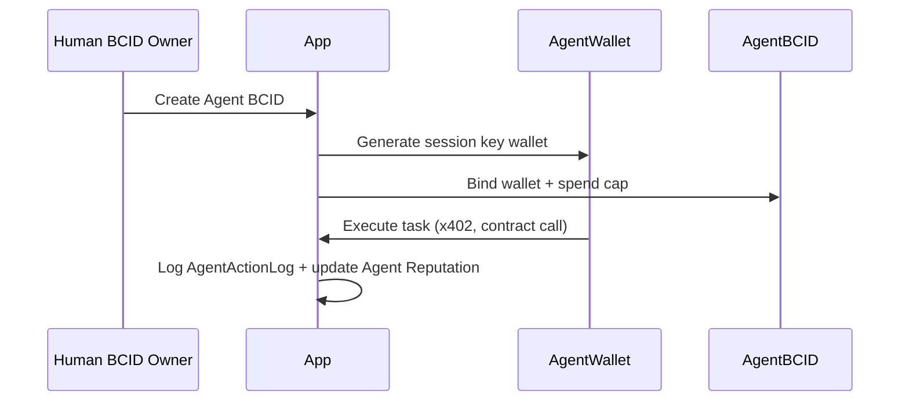

# BCID Wallet Architecture

Multi-chain wallet linking, recovery, and agent wallet delegation.

---

## Wallet types

| Type | Owner | Transferable | Recovery |
|------|-------|--------------|----------|
| **Primary EVM** | Human/Company BCID holder | N/A (linked) | Guardian timelock |
| **Linked EVM** | Same BCID | N/A | Via primary |
| **XRPL** | Same BCID | N/A | Manual re-link |
| **Agent wallet** | Agent BCID | No (delegated) | Revoked by owner |

---

## Primary wallet

- Set at BCID mint (minter address)
- SIWE required for all privileged operations
- Stored: `BcidIdentity.ownerAddress` + onchain `BcidRegistry.ownerOf`

### Link additional wallets

Reuse pattern from live `LinkedWallet` model:

```
POST /api/bcid/wallets/link
Body: { chain: "evm" | "xrpl", address, signature, challenge }
```

---

## Recovery architecture

See [../security/RECOVERY_ARCHITECTURE.md](../security/RECOVERY_ARCHITECTURE.md).

**Summary:**
- 2-of-3 guardians required
- 72-hour timelock after guardian approval
- Recovery fee: 0.01 ETH (anti-spam, burned)
- New owner must SIWE within 24h of timelock expiry

### Guardian setup flow

```
User → POST /api/bcid/recovery/guardians { addresses: [0x, 0x, 0x] }
     → Onchain RecoveryModule.setGuardians()
     → Trust Score +15 on completion
```

---

## Agent wallet delegation



### Session key constraints
- Max spend per tx: `spendCapWei` (default 0.1 ETH equiv)
- Allowed contracts: whitelist in policy JSON
- Expiry: 30 days (renewable by owner)
- Revocation: instant via owner SIWE

---

## Multi-chain references

| Chain | Purpose | Status |
|-------|---------|--------|
| Base (8453) | BCID registry, credentials | Primary |
| Base Sepolia (84532) | Testnet Month 2 | Active |
| XRPL | Optional payment/trust rail | Linked only |
| zkSync Era | ZK proof verification (optional) | Month 6 eval |

---

## Integration with live stack

- Reuse `app/src/server/wallet/xrpl-link.ts` for XRPL
- Reuse SIWE middleware from credential claim flow
- Privy smart wallet supported for primary (existing `/join` flow)
