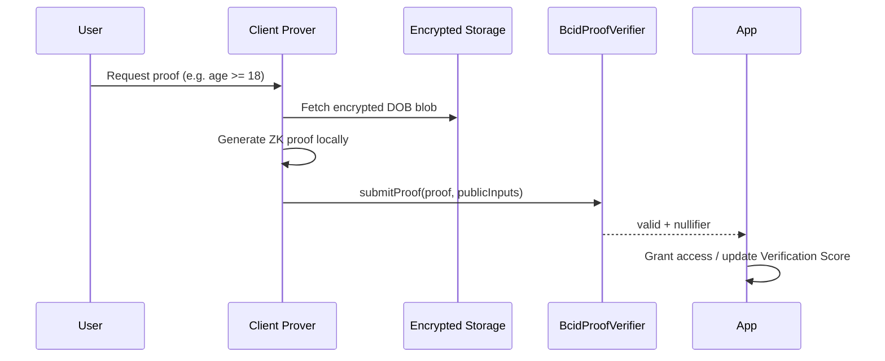

# BCID ZK Privacy Architecture

Privacy layer: what stays on-chain, what stays encrypted, which proofs are needed.

---

## Boundary decisions

| Data | Location | Rationale |
|------|----------|-----------|
| BCID token ID + owner | Onchain | Public accountability |
| Credential token ID + schema hash | Onchain | Verifiable without PII |
| Proof nullifiers | Onchain | Sybil prevention |
| PII (name, DOB, KYC docs) | Encrypted storage | GDPR + user control |
| Reputation scores | Postgres | Computed from verifiable events |
| Full credential payload | Encrypted storage | Selective disclosure only |

---

## Proof types (v1)

### 1. Age Proof
**Claim:** `age >= threshold` (e.g., 18, 21)  
**Input:** Encrypted DOB in user blob  
**Verifier:** ZK circuit on commitment  
**Onchain:** `BcidProofVerifier.verifyAge(nullifier, threshold, proof)`  
**Launch:** Month 6

### 2. Human Proof
**Claim:** Unique human (sybil-resistant)  
**Inputs (any):**
- World ID nullifier hash (preferred Tier 2)
- Web3.bio isHuman attestation (Tier 1)
- Video liveness hash (Tier 3)

**Onchain:** Nullifier registry (prevent double-mint)  
**Launch:** Month 6 (World ID); Tier 1 live via Web3.bio today

### 3. Ownership Proof
**Claim:** `owner holds asset X` or `owner holds credential Y`  
**Input:** Merkle proof against onchain registry or EAS attestation root  
**Use cases:** Asset BCID, certificate verification, access gating  
**Launch:** Month 5 (hash commitment); Month 6 (ZK)

### 4. KYC Proof
**Claim:** `jurisdiction compliant` / `accredited investor` without revealing identity  
**Input:** Encrypted KYC blob + issuer signature  
**Verifier:** Partner oracle or self-hosted verify API → ZK wrapper  
**Launch:** Month 6 (jurisdiction-scoped, optional)

---

## zkSync role

**Decision:** zkSync is **not** the primary BCID chain. Use zkSync patterns for:

| Pattern | Application |
|---------|-------------|
| ZK-SNARK verification | `BcidProofVerifier` on Base |
| Account abstraction | Agent wallet session keys (Base AA when available) |
| Privacy rollup (future) | High-volume proof batching if Base costs exceed threshold |

Proof verification contracts deploy on **Base** (existing ecosystem home).

---

## Proof flow



---

## Nullifier registry

Prevent double-spending of human uniqueness:

```solidity
mapping(bytes32 => bool) public spentNullifiers;

function verifyHuman(bytes32 nullifier, bytes calldata proof) external {
    require(!spentNullifiers[nullifier], "Already verified");
    require(_verifyProof(proof), "Invalid proof");
    spentNullifiers[nullifier] = true;
}
```

---

## Selective disclosure API (Month 5)

```
POST /api/bcid/proofs/disclose
Body: {
  "did": "did:bcid:human:...",
  "proofType": "ownership",
  "proof": "0x...",
  "publicInputs": [...]
}
Response: { "valid": true, "accessToken": "..." }
```

---

## Month 1 deliverable status

- [x] On-chain vs encrypted boundary defined
- [x] Four proof types specified
- [x] zkSync role clarified (patterns, not primary chain)
- [ ] Circuit implementation (Month 6)
- [ ] World ID integration (Month 6)
