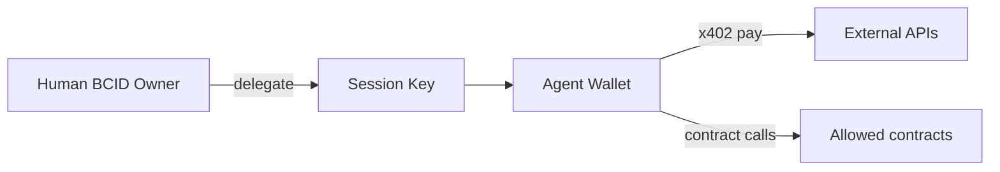

# BCID Agent Economy

Agent NFT, wallet, reputation, revenue, and marketplace specification.

Extends [BCD_AGENT_MONETIZATION.md](../BCD_AGENT_MONETIZATION.md) and [ERC8004_AGENT_REGISTRY.md](../ERC8004_AGENT_REGISTRY.md).

---

## Components

| Component | Description | Launch |
|-----------|-------------|--------|
| **Agent BCID** | Soulbound agent identity | Month 4 |
| **Agent Wallet** | Delegated session-key wallet | Month 4 |
| **Agent Reputation** | Task completion + spend integrity score | Month 4 |
| **Agent Revenue** | x402 + marketplace fee split | Live (extend) |
| **Agent Marketplace** | Discovery + hire agents | Month 4 |

---

## Agent BCID

**DID:** `did:bcid:agent:{uuid}`

```json
{
  "type": "agent",
  "ownerBcidDid": "did:bcid:human:{uuid}",
  "agentWalletAddress": "0x...",
  "agentCardUrl": "https://app.buildingcultureid.space/.well-known/agent.json",
  "erc8004Id": "optional",
  "spendCapWei": "100000000000000000",
  "policyHash": "ipfs://...",
  "capabilities": ["research", "grant", "marketing", "builder"]
}
```

Mint cost: 1 BCC → agent economy fund.

---

## Agent Wallet



- Generated at Agent BCID mint (Privy or local key)
- Session key expires 30 days
- Owner revokes instantly via SIWE
- Spend cap enforced in app middleware before tx broadcast

---

## Agent Reputation

Separate from Human BCID scores. Agent-specific:

| Input | Weight |
|-------|--------|
| Completed tasks (verifiable) | 40% |
| x402 settlement success rate | 25% |
| Owner retention (days active) | 15% |
| User ratings (post-task, capped) | 10% |
| Trusted Agent credential | 10% |

**Not included:** social metrics, follower counts.

Stored: `BcidReputationScore` with `type=agent` extension or separate `AgentBcidScore` table.

---

## Agent Revenue

| Flow | Split |
|------|-------|
| x402 API payment | 95% agent wallet / 5% treasury |
| AgentShare NFT yield | Existing campaign contract |
| Marketplace listing sale | Thirdweb fee + 5% BC platform |
| Grant agent success fee | 10 BCC from grant pool |

Existing: [`GET /api/x402/premium`](../../app/src/routes/api/x402/premium.tsx), AgentShare campaign.

---

## Agent Marketplace

**Route:** `/bcid/agents` (Month 4)

| Feature | Description |
|---------|-------------|
| Discovery | Filter by capability, reputation, price |
| Hire | x402 or BCC escrow |
| Profile | Agent BCID + agent card + reputation |
| Registry | ERC-8004 + 8004scan link |

Integrates with existing `/agent-os` catalog — Agent OS agents can register Agent BCID.

---

## Agent NFT

Extends `AgentId.sol` and `AgentShareCampaign.sol`:

| NFT | Purpose |
|-----|---------|
| Agent BCID token | Soulbound identity (BcidRegistry type=agent) |
| AgentShare NFT | Revenue share / campaign (existing) |

Not the same token — Agent BCID = identity; AgentShare = capital instrument.

---

## Personal Builder Agent (Month 4 outcome)

Each Human BCID holder can spawn one default Builder Agent:
- Pre-configured BC Studio access
- Spend cap: 0.05 ETH
- Policy: build tasks only
- Free first month; 0.5 BCC/month after

---

## Month 4 exit criteria

- 10 agents with Agent BCID + wallet registered
- Agent reputation visible on profile
- x402 revenue logged to agent wallet
