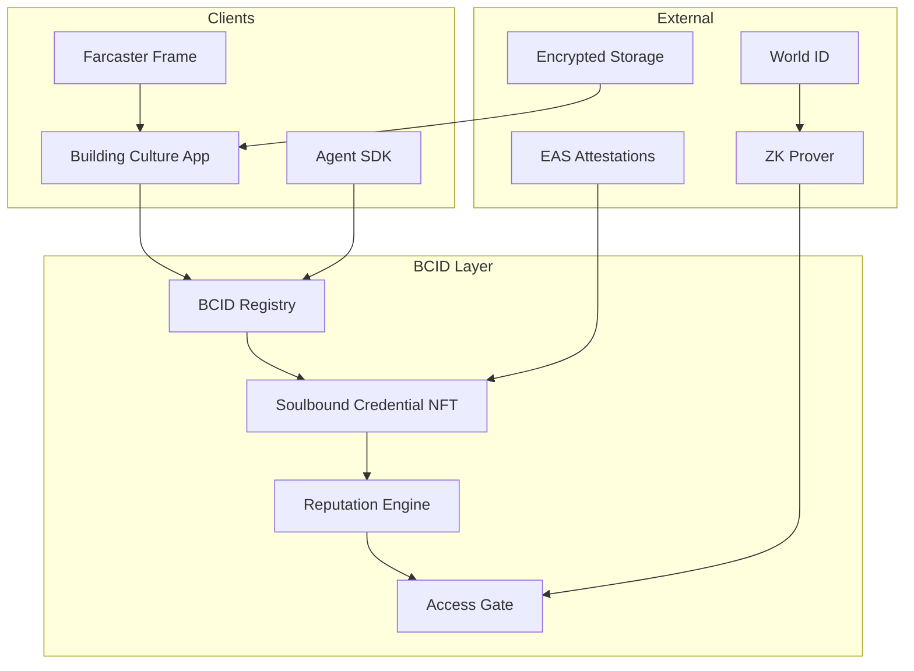

# BCID v1 Product Requirements Document

**Version:** 1.0-draft  
**Status:** Phase 0 foundation  
**Canonical entry:** [protocol/README.md](./README.md)

---

## 1. Executive summary

Building Culture Identity (BCID) v1 is a privacy-first, portable identity protocol with verifiable reputation, social recovery, and agent ownership. It runs **in parallel** with the live `.culture` NFT trust layer on Base — no breaking changes to production.

**Positioning:** BCID is to verifiable professional identity what ENS is to names — but soulbound, reputation-rich, privacy-preserving, and agent-native.

**Primary differentiators vs LinkedIn, Farcaster, ENS:**
- Verifiable contributions, not vanity metrics
- Four identity types (Human, Company, Asset, Agent)
- Encrypted credentials with ZK selective disclosure
- Guardian-based recovery
- BCC-aligned economic layer

**Month 3 launch target:** 100 Human BCIDs minted on Base Sepolia → Base mainnet.

---

## 2. Problem statement

### Hypothesized pain points (validated by WS2 user research)

| # | Pain | Who feels it |
|---|------|--------------|
| 1 | Professional credentials are not portable across platforms | Builders, freelancers |
| 2 | Web3 identity = wallet address; no human-readable trust signal | All users |
| 3 | Sybil attacks undermine community programs | Protocol operators |
| 4 | No standard for AI agent identity + accountability | Agent developers |
| 5 | Asset ownership proofs (property, certs) are paper-based or siloed | RWA participants |
| 6 | Identity recovery is wallet-seed dependent | Mainstream users |
| 7 | Reputation systems reward followers, not shipped work | Builders |
| 8 | KYC data is over-collected and under-protected | Privacy-conscious users |

### Why not existing solutions?

See [COMPETITOR_ANALYSIS.md](./COMPETITOR_ANALYSIS.md). Summary: Farcaster is social-not-portable; ENS is transferable-without-reputation; World ID is human-only; EAS has no namespace; Gitcoin Passport scores are opaque; Lens is creator-social-first.

### Existing BC traction (as-built)

- `.culture` mint live on Base (`/pass`)
- 6 credential types in Postgres Credential Center
- Culture Reputation score (single composite — **deprecated for BCID path**)
- Agent OS + AgentShare economy
- Waitlist + PostHog funnels at `app.buildingcultureid.space`

---

## 3. BCID identity model

### 4 BCID types

| Type | Namespace | Soulbound | Primary use |
|------|-----------|-----------|-------------|
| **Human** | `did:bcid:human:{id}` | Yes | Individual identity, credentials, reputation |
| **Company** | `did:bcid:company:{id}` | Yes | Org identity, delegated admins, project creds |
| **Asset** | `did:bcid:asset:{id}` | Yes | Tokenized house/car/watch/business/cert |
| **Agent** | `did:bcid:agent:{id}` | Yes | AI agent wallet, reputation, revenue |

### Metadata schema (Human BCID v1)

```json
{
  "version": "1.0",
  "type": "human",
  "displayName": "string",
  "publicHandle": "string",
  "createdAt": "ISO8601",
  "recoveryGuardians": ["0x..."],
  "linkedAccounts": {
    "farcaster": { "fid": 123, "verified": true },
    "ens": { "name": "alice.eth", "verified": true },
    "cultureId": { "handle": "alice.culture", "tokenId": "42" }
  },
  "publicProfile": {
    "bio": "string",
    "avatarUri": "ipfs://...",
    "website": "https://..."
  },
  "encryptedProfileRef": "ipfs://... (encrypted PII bucket)"
}
```

### Issuance rules

| Type | Issuer | Requirements |
|------|--------|--------------|
| Human | BCID Registry contract | SIWE + optional Human Proof |
| Company | BC admin + Company admin SIWE | KYB doc hash (encrypted) |
| Asset | Asset oracle + owner BCID | Ownership proof + metadata standard |
| Agent | Owner Human/Company BCID | ERC-8004 registration + agent card |

Full spec: [IDENTITY_ARCHITECTURE.md](../architecture/IDENTITY_ARCHITECTURE.md).

---

## 4. Competitive differentiation

| Pillar | BCID approach |
|--------|---------------|
| **Privacy** | Encrypted credential storage; ZK proofs for Age/Human/Ownership/KYC |
| **Reputation** | 4 scores: Builder, Trust, Contribution, Verification — no follower weight |
| **Recovery** | 2-of-3 guardian timelock (72h delay) |
| **Agent ownership** | Agent BCID binds wallet + reputation + revenue split |
| **Interop** | `.culture` bridge; Farcaster link; EAS attestations; World ID proof |

---

## 5. User flows

### 5.1 Mint Human BCID

```
User → Connect wallet (SIWE) → Choose handle → Pay mint fee (ETH or BCC)
     → BCID Registry mints soulbound token → App syncs Postgres BcidIdentity
     → Optional: link .culture via bridge
```

### 5.2 Claim credential

```
User → Credential Center → Eligibility check (contributions, proofs)
     → Issue off-chain UserCredential + optional EAS attestation
     → Soulbound credential NFT (high-trust) or Postgres-only (low-trust)
     → ReputationEvent appended → Scores recalculated
```

### 5.3 Recover identity

```
User → Initiate recovery → Guardians sign approval (2-of-3)
     → 72h timelock → New owner wallet set on BCID Registry
     → Linked wallets re-verified via SIWE
```

### 5.4 Delegate to agent

```
User (Human BCID) → Mint Agent BCID → Set spend cap + policy
     → Agent wallet receives session key → Agent earns revenue
     → Agent Reputation updated from verifiable task completions
```

### 5.5 Selective disclosure (ZK)

```
User → Request access (e.g. "prove age > 18") → Generate ZK proof locally
     → Verifier contract checks proof → Access granted without PII exposure
```

---

## 6. Architecture

### System context



### Trust boundaries

| Zone | Data | Trust level |
|------|------|-------------|
| Onchain | BCID token ID, owner, credential token IDs, proof nullifiers | Public |
| Postgres | Eligibility, events, linked accounts, scores | App-trusted |
| Encrypted storage | PII, KYC docs, certificates | User-key encrypted |
| ZK proofs | Claim statements only | Zero-knowledge |

Detail: [architecture/](../architecture/) tree.

---

## 7. Database schema

Delta from live `app/prisma/schema.prisma`. Full spec: [DATABASE_SCHEMA.md](../architecture/DATABASE_SCHEMA.md).

**New models:** `BcidIdentity`, `BcidLinkedAccount`, `BcidCredential`, `BcidReputationScore`, `BcidRecoveryGuardian`, `BcidBridgeLink`

**Unchanged:** `CultureIdentity`, `Credential`, `UserCredential` (legacy path until bridge migration).

---

## 8. Smart contracts

Deploy target: **Base Sepolia** (testnet Month 2), **Base mainnet** (Month 3).

| Contract | Purpose |
|----------|---------|
| `BcidRegistry` | Soulbound BCID mint (Human v1) |
| `BcidSoulboundCredential` | Onchain credential tokens |
| `BcidProofVerifier` | ZK proof verification (Month 6) |
| `BcidRecoveryModule` | Guardian timelock recovery |

Source: `contracts/src/bcid/`. Full spec: [SMART_CONTRACTS.md](../architecture/SMART_CONTRACTS.md).

---

## 9. API design

Base path: `/api/bcid/`

| Method | Path | Purpose |
|--------|------|---------|
| GET | `/api/bcid/resolve?did=` | Resolve BCID DID → owner + metadata |
| POST | `/api/bcid/sync` | SIWE-gated post-mint sync |
| POST | `/api/bcid/bridge/culture` | Link `.culture` token to Human BCID |
| GET | `/api/bcid/{did}/scores` | Builder/Trust/Contribution/Verification |
| GET | `/api/bcid/catalog` | BCID credential catalog |
| POST | `/api/bcid/credentials/claim` | Claim BCID credential |
| GET | `/api/bcid/farcaster/frame` | Farcaster Frame HTML |
| POST | `/api/bcid/waitlist/convert` | Waitlist → BCID mint invite |

Full spec: [API_DESIGN.md](../architecture/API_DESIGN.md).

---

## 10. Reputation model

Four independent scores (0–100 each). **No social follower weight.**

| Score | Inputs | Anti-patterns excluded |
|-------|--------|------------------------|
| **Builder** | Studio projects, deploys, grant milestones, build tasks | Follower count, NFT floor price |
| **Trust** | Credential count (tier-weighted), identity age, guardian setup | Social graph size |
| **Contribution** | Culture Points, quests, campaigns, referrals (capped) | Raw referral farming |
| **Verification** | World ID, video verify, KYC proof, Web3.bio isHuman | Platform stamp collection |

Implementation: `app/src/lib/identity/bcid-reputation.ts` (separate from `culture-score.ts`).

Detail: [REPUTATION_ARCHITECTURE.md](../architecture/REPUTATION_ARCHITECTURE.md).

---

## 11. Tokenomics implications

| Action | Fee | Destination |
|--------|-----|---------------|
| Human BCID mint | ~$1.11 USD equiv (ETH or BCC -11.11%) | Treasury 70% / Burn 20% / Validator 10% |
| Credential issuance (onchain) | Gas + 0.1 BCC | Issuer pool |
| Agent BCID mint | 1 BCC | Agent economy fund |
| Recovery initiation | 0.01 ETH (anti-spam) | Burn |

Full model: [TOKENOMICS.md](./TOKENOMICS.md).

---

## 12. Interop with .culture

BCID v1 runs parallel. Bridge rules in [INTEROP_CULTURE_ID.md](./INTEROP_CULTURE_ID.md).

**Summary:**
- `.culture` owner can mint Human BCID with linked handle (no double pay if founding)
- Culture Reputation events feed BCID Contribution Score (weighted 0.5x during dual period)
- Credentials earned on `.culture` path auto-eligible on BCID path
- No forced migration; incentives via BCC airdrop for bridge completers (Month 3)

---

## 13. 6-month execution roadmap

| Month | Outcomes | Exit criteria |
|-------|----------|---------------|
| **1** | PRD, competitor analysis, user research launch, storage/ZK drafts | PRD approved; threat model reviewed |
| **2** | Testnet registry, soulbound creds, Builder Score v1, bridge API | Testnet mint E2E |
| **3** | 100 Human BCIDs, Farcaster Frame, waitlist conversion | 100 on-chain BCIDs |
| **4** | Agent BCID type, Personal Builder Agent, Agent NFT path | 10 agents registered |
| **5** | Encrypted credential storage, selective disclosure API | Cred upload/retrieve E2E |
| **6** | World ID, video verify, KYC proof; Verification Score live | 3 proof types operational |

---

## 14. Open questions

| # | Question | Owner workstream | Decision by |
|---|----------|------------------|-------------|
| 1 | Base Sepolia vs Base mainnet for first 100? | WS10 GTM | Month 2 |
| 2 | EAS on Base vs offchain-only for v1 creds? | WS1 Protocol | Month 2 |
| 3 | 4EVERLAND vs Arweave for encrypted bucket? | WS5 Storage | Month 1 |
| 4 | World ID Orb required for Verification tier 2? | WS6 ZK | Month 5 |
| 5 | Company BCID KYB provider? | WS7 Identity | Month 4 |
| 6 | Agent revenue split % (platform vs owner)? | WS9 Agent Economy | Month 4 |
| 7 | `.culture` → BCID migration BCC incentive amount? | WS3 Tokenomics | Month 3 |
| 8 | Video verification vendor (self-hosted vs API)? | WS6 ZK | Month 6 |

---

## 15. Implementation debt (from as-built audit)

These MUST be addressed in BCID path (not patched into legacy `.culture` path):

| Issue | BCID v1 fix |
|-------|-------------|
| Credentials off-chain only | Soulbound credential NFT for high-trust; EAS anchor |
| `AccessRule` not enforced | `AccessGate` middleware on BCID-gated routes |
| Leaderboard snapshot never called | Cron job for BCID leaderboard |
| Culture ID transferable | BCID soulbound by design |
| Social follower weight in score | Excluded from BCID reputation engine |
| `xrplCredentialHash` never written | Optional XRPL anchor in Month 5+ |

---

## Appendix A: Related documents

- [COMPETITOR_ANALYSIS.md](./COMPETITOR_ANALYSIS.md)
- [INTEROP_CULTURE_ID.md](./INTEROP_CULTURE_ID.md)
- [../architecture/](../architecture/)
- [../security/](../security/)
- [../TRUST_LAYER.md](../TRUST_LAYER.md) (live product)

## Appendix B: Success metrics (Month 3)

| Metric | Target |
|--------|--------|
| Human BCIDs minted | 100 |
| Bridge completions (.culture → BCID) | 30 |
| Farcaster Frame mints | 25 |
| Waitlist → BCID conversion | 15% |
| Builder Score computed | 100% of BCID holders |
