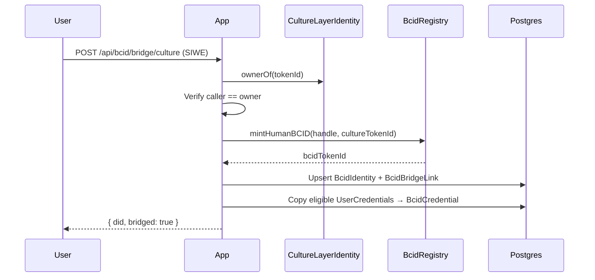

# BCID ↔ Culture ID Interoperability

BCID v1 is a **parallel standard**. The live `.culture` ERC-721 trust layer remains production. This document defines bridge rules, dual-identity period, and migration incentives.

---

## Principles

1. **No breaking changes** — `.culture` mint, credentials, and Culture Reputation stay live
2. **Opt-in bridge** — users choose when to mint Human BCID
3. **Credential portability** — earned credentials map 1:1 where categories align
4. **Reputation feed-forward** — Culture events contribute to BCID scores at reduced weight during dual period
5. **Single wallet owner** — bridge requires same EVM address owns both tokens

---

## Identity mapping

| Live (Culture ID) | BCID v1 equivalent |
|-------------------|-------------------|
| `.culture` NFT (transferable) | Human BCID (soulbound) — linked, not replaced |
| `CultureIdentity` Postgres row | `BcidIdentity` + `BcidBridgeLink` |
| `UserCredential` (6 types) | `BcidCredential` (extended catalog) |
| `computeCultureScore()` | `computeBcidReputation()` (4 scores) |
| `Member.farcasterFid` | `BcidLinkedAccount` platform=farcaster |

---

## Bridge flow



### API: `POST /api/bcid/bridge/culture`

**Auth:** SIWE session required

**Body:**
```json
{
  "cultureHandle": "alice.culture",
  "cultureTokenId": "42"
}
```

**Validation:**
- Caller wallet owns `cultureTokenId` on `CultureLayerIdentity`
- No existing `BcidBridgeLink` for this culture token
- Human BCID not already minted for this wallet (or link to existing)

**Response:**
```json
{
  "ok": true,
  "did": "did:bcid:human:abc123",
  "cultureHandle": "alice.culture",
  "credentialsMigrated": 3,
  "contributionScoreSeed": 12.5
}
```

---

## Credential mapping

| Culture credential slug | BCID credential slug | Auto-migrate |
|-------------------------|---------------------|--------------|
| `builder` | `bcid-builder` | Yes |
| `contributor` | `bcid-contributor` | Yes |
| `community-leader` | `bcid-community-leader` | Yes |
| `verified-human` | `bcid-verified-human` | Yes |
| `trusted-agent` | N/A (Agent BCID path) | Manual |
| `verified-project` | `bcid-verified-project` | Yes |

---

## Reputation feed-forward (dual period)

During Months 2–4 (dual-identity period):

| Culture Reputation dimension | BCID score | Weight |
|------------------------------|------------|--------|
| Credentials | Trust Score | 0.5x |
| Contributions | Contribution Score | 0.5x |
| Social trust | **Excluded** | 0x |
| Human verification | Verification Score | 1.0x |

After Month 4: Culture Reputation frozen for new BCID holders; BCID scores are sole source.

---

## Migration incentives (Month 3)

| Action | Incentive |
|--------|-----------|
| Bridge `.culture` → Human BCID | 50 BCC airdrop (cap: first 500) |
| Mint Human BCID (no .culture) | Standard mint price |
| Complete 3 BCID credentials post-bridge | Builder Score boost (+10 Contribution) |

Amounts subject to WS3 Tokenomics review. Treasury source: BCC ecosystem fund.

---

## Namespace coexistence

| Namespace | Example | Transferable | Primary profile URL |
|-----------|---------|--------------|---------------------|
| `.culture` | `alice.culture` | Yes | `/id/alice.culture` |
| BCID DID | `did:bcid:human:abc123` | N/A (soulbound) | `/bcid/did:bcid:human:abc123` |
| Public handle | `alice` (BCID metadata) | No | `/bcid/alice` |

Profile page shows both when bridged:
- Culture ID badge (legacy)
- BCID badge (primary for new features)

---

## What stays on `.culture` only (v1)

- Transferable name market (if any)
- Founding cap (5000) semantics
- TLD variants (`.build`, `.home`, etc.)
- V2 BCC mint rail (`CultureLayerIdentityV2`)

BCID does not replicate TLD namespace in v1. Human BCID uses DID + optional public handle.

---

## Deprecation timeline (not v1 scope)

| Phase | Timeline | Action |
|-------|----------|--------|
| Parallel | Month 1–6 | Both systems live |
| Bridge push | Month 3–4 | Incentives + UI nudge |
| Feature gate | Month 5+ | New features BCID-only |
| Sunset eval | Month 12+ | Community vote on `.culture` read-only |

No automatic sunset in v1 PRD.

---

## Human review checklist

- [x] Parallel standard confirmed (not replacement)
- [x] Bridge API spec defined
- [x] Credential mapping table complete
- [x] Social reputation excluded from BCID feed-forward
- [ ] BCC incentive amount approved (WS3)
- [ ] Month 2 scope: bridge API only on testnet (no mainnet bridge until Month 3)
