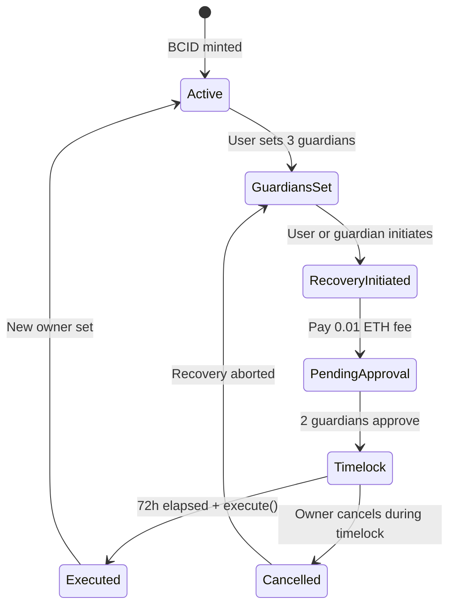

# BCID Recovery Architecture

Social recovery with guardian timelock. 2-of-3 guardians, 72-hour delay.

---

## Overview

BCID Human identities are soulbound — loss of primary wallet without recovery means permanent lockout. Recovery enables guardian-approved ownership transfer.

---

## Guardian model

| Parameter | Value |
|-----------|-------|
| Guardian count | 3 required |
| Approval threshold | 2-of-3 |
| Timelock | 72 hours after 2nd approval |
| Initiation fee | 0.01 ETH (burned) |
| Execution window | 24 hours after timelock |

---

## Flow



---

## Setup: `POST /api/bcid/recovery/guardians`

**Requirements:**
- SIWE authenticated BCID owner
- 3 distinct EVM addresses (not owner, not each other)
- Onchain: `BcidRecoveryModule.setGuardians([g1, g2, g3])`

**Trust Score impact:** +20 on completion (max once)

---

## Initiate: `POST /api/bcid/recovery/initiate`

```json
{
  "bcidTokenId": "1",
  "newOwnerAddress": "0x..."
}
```

- Callable by current owner OR any guardian (if owner unresponsive)
- Pays 0.01 ETH to contract (burned)
- Emits `RecoveryInitiated(bcidTokenId, newOwner, executeAfter)`

---

## Approve: `POST /api/bcid/recovery/approve`

- Guardian SIWE must match one of 3 guardians
- Second approval starts 72h timelock
- Owner notified via email (if on file) + optional Farcaster DM

---

## Execute: `POST /api/bcid/recovery/execute`

- Callable after timelock by anyone (public execute pattern)
- Sets `BcidRegistry` owner to `newOwnerAddress`
- Postgres `BcidIdentity.ownerAddress` updated via event listener
- Linked wallets require re-verification (SIWE)

---

## Cancel

- Current owner can cancel during timelock (before execute)
- No fee refund on cancel

---

## Security considerations

| Risk | Mitigation |
|------|------------|
| Guardian collusion (2-of-3 attack) | User chooses trusted guardians; timelock allows cancel |
| Griefing (spam initiate) | 0.01 ETH fee per attempt |
| Front-running execute | Acceptable — execute is permissionless by design |
| Recovery to attacker address | Guardians are trust assumption; educate users |

---

## Comparison to ENS

| Feature | ENS | BCID v1 |
|---------|-----|---------|
| Social recovery | Limited (wrapper-dependent) | Native 2-of-3 + timelock |
| Fee on recovery | Gas only | 0.01 ETH anti-spam |
| Guardian setup | Optional | Encouraged (Trust Score boost) |

---

## Month 2 scope

- [x] Architecture spec
- [ ] `BcidRecoveryModule.sol` deploy testnet
- [ ] API routes (guardians, initiate, approve, execute)
- [ ] UI on `/bcid/recovery` (Month 3)
